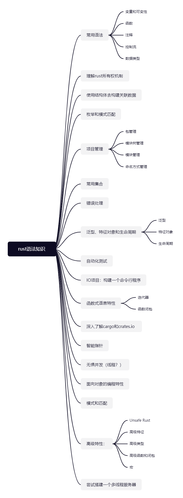
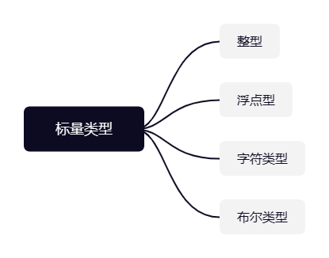
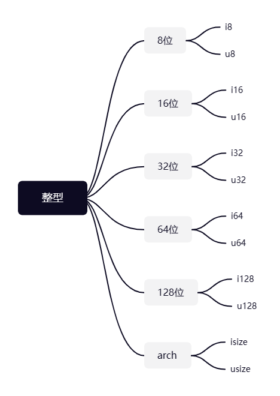

# Rust相关知识的思维导图



# 浅入Rust基础

**目标：首先总结归纳Rust的基本内容，接着每天回顾一个了解过的rust基础**

## 常用语法

### 变量和可变性

- 变量的声明 

  ```rust
  //let 变量名:变量类型 = 变量值
  let x = 5
  ```

- 常量的声明

  ```rust
  //const 常量名:常量类型 = 常量值
  const THE_X:U32 = 60*3;
  ```

- 变量的可变性标记

  ```rust
  //变量的可变性标记 mut
  let mut x = 5;
  x = 6;
  ```

  **其他说明：**

  - 可变变量重新声明成常态变量后，可变性会被覆盖掉，同时也会有相应的错误提示。

    ```rust
    let mut x = 5;
    let x = x+1;
    x = x+2; //cannot mutate immutable variable `x`
    ```

- 变量的封闭性

  变量的封闭性可以理解成，声明同名变量，会将上一个声明覆盖，直到下一个同名变量被声明，或者作用域结束。

  ```rust
  fn variablie(){
      let x = 5;
      let x = x + 2;
      {
          let x = x * x;
          println!("作用域内x = {}",x);
      }
      println!("变量x = {}",x);
  }
  ```

  ```
  //output
  作用域内x = 49
  变量x = 7
  ```

  x为可变变量，x在内部块作用域内重新声明并赋值

  ```rust
  fn variablie_mut(){
      let mut x = 5;
      x = x+1;
      {
          let x = x * x;
          println!("在作用域内可变变量x = {}",x);
      }
      println!("可变变量x = {}",x);
  }
  ```

  ```
  //output
  在作用域内可变变量x = 36
  可变变量x = 6
  ```
  x为可变变量，x在内部块作用域内仅仅重新赋值
  ```rust
  fn variablie_mut(){
      let mut x = 5;
      x = x+1;
      {
          x = x * x;
          println!("在作用域内可变变量x = {}",x);
      }
      println!("可变变量x = {}",x);
  }
  ```

  ```
  //output
  在作用域内可变变量x = 36
  可变变量x = 36
  ```


### 数据类型
#### 标量类型



##### 整型

Rust的整型类型根据长度划分有6类和有字符和无字符组合起来一共有12中整型类型如下图：



每一种存储类型的存储空间的计算公式（除了arch类型）：
$$
-(2^{n-1})\ \ to\ \  2^{n-1}-1
$$
**注意**：

arch类型取决于计算机架构，64位架构对应n = 64，32位架构对应n = 32。

##### 浮点型

```rust
let x = 1.0; //默认f64
let y:f32 = 2.0; //声明类型f32
```

##### 数值操作

数值操作主要包括增、删、改、查和取余。

```rust
// addition
    let sum = 5 + 10;

    // subtraction
    let difference = 95.5 - 4.3;

    // multiplication
    let product = 4 * 30;

    // division
    let quotient = 56.7 / 32.2;
    let truncated = -5 / 3; // Results in -1

    // remainder
    let remainder = 43 % 5;
```

##### 布尔类型

布尔类型的只有两个值：true和false。

布尔类型只有一个字节。

在Rust中实际是使用bool比如：

```rust
let t = true;
let f:bool = false;
```

布尔类型的主要作用是条件判断。比如控制流中的**if**表达式

##### 字符类型

Rust 的char 类型是该语言最基础的字母类型例如：

```rust
fn main() {
    let c = 'z';
    let z: char = 'ℤ'; // with explicit type annotation
    let heart_eyed_cat = '😻';
}
```

**注意：**

字符字面量使用单引号，而字符串字面量使用双引号

Rust的字符类型大小是4字节而且代表Unicode标量值。这意味着它可以表示的不仅仅是ASCII。重音字母;中文、日文、韩文;emoji;和零宽度空格在Rust中都是有效的字符值.

#### 复合类型

复合类型的目标场景：可以将多个值组到一个类型中。

Rust 拥有两个原始复合类型

1. 元组
2. 数组

##### 元组

元组是一种将多种类型的值组合成一种复合类型的通用方法。

元组有固定的长度:一旦声明，它们就不能增大或缩小

例如：

```rust
let tup:(i32,f64,u8) = (500,6.4,1);
```

元组解构

- 用模式匹配的方式解构元组

```rust
//声明元组
let tup = (500,6.4,1);
let (x,y,z) = tup;
println!("x = {}\n y = {} \n z = {}",x,y,z);
```

- 使用 (*.*) 的方式进行解构

```rust
fn main() {
    let x: (i32, f64, u8) = (500, 6.4, 1);

    let five_hundred = x.0;

    let six_point_four = x.1;

    let one = x.2;
    println!("x = {}\n y = {} \n z = {}",five_hundred,six_point_four,one);
}
```

 空元组拥有一个特殊的名字**unit**，这个值写作**()**代表元组空值类型位一个空的返回类型。

##### 数组

数组的声明
```rust
let a = [1,2,3,4,5];
```

**注意：**

1. 如果你希望在堆栈上分配数据而不是直接在堆上分配，数组非常有用的。

2. 当你确保你的元素是具有固定长度时，数组非常有用。

3. 但数组并没有像容器（*Vector*）那样，大小可以灵活的增加或者减少

4. 然而数组对于固定长度且不需要变化的固定值集合更有用比如：月份数组

```rust
let months = ["January", "February", "March", "April", "May", "June", "July", "August", "September", "October", "November", "December"];
```

声明类型和长度

$$
let\ 变量名:[成员类型;数组长度] = [成员1,成员2,...]
$$

```rust
//声明类型和长度
let a:[i32;5] = [1,2,3,4,5];

```

快速声明元素相同的数组

$$
let\ 变量名:[成员值;数组长度];
$$

```rust
let a = [3;5]
// a = [3,3,3,3,3]

```

有效数组访问机制：通过数组索引去访问，但索引不能超过数组的长度。

### 函数

##### 参数

##### 语句和表达式

##### 函数返回值

### 注释


### 控制流

##### if 表达式

##### loop循环体

##### 循环标签

##### 集合的for循环


