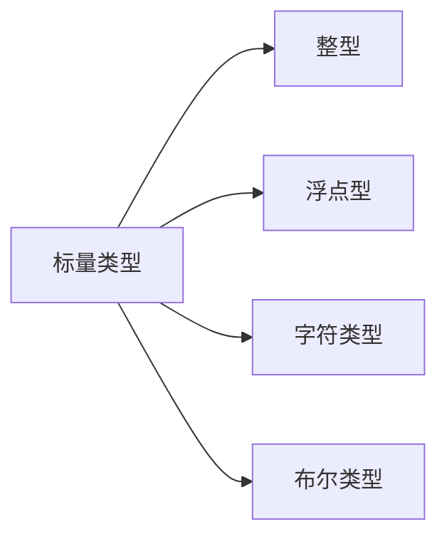
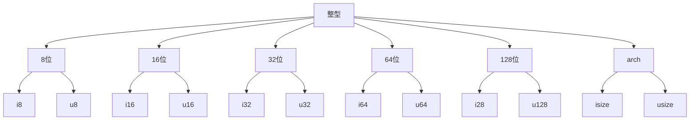

# Rust相关知识的思维导图


# 浅入Rust基础

**目标：首先总结归纳Rust的基本内容，接着每天回顾一个了解过的rust基础**

## 常用语法

### 变量和可变性

- 变量的声明 

  ```rust
  //let 变量名:变量类型 = 变量值
  let x = 5
  ```

- 常量的声明

  ```rust
  //const 常量名:常量类型 = 常量值
  const THE_X:U32 = 60*3;
  ```

- 变量的可变性标记

  ```rust
  //变量的可变性标记 mut
  let mut x = 5;
  x = 6;
  ```

  **其他说明：**

  - 可变变量重新声明成常态变量后，可变性会被覆盖掉，同时也会有相应的错误提示。

    ```rust
    let mut x = 5;
    let x = x+1;
    x = x+2; //cannot mutate immutable variable `x`
    ```

- 变量的封闭性

  变量的封闭性可以理解成，声明同名变量，会将上一个声明覆盖，直到下一个同名变量被声明，或者作用域结束。

  ```rust
  fn variablie(){
      let x = 5;
      let x = x + 2;
      {
          let x = x * x;
          println!("作用域内x = {}",x);
      }
      println!("变量x = {}",x);
  }
  ```

  ```
  //output
  作用域内x = 49
  变量x = 7
  ```

  x为可变变量，x在内部块作用域内重新声明并赋值

  ```rust
  fn variablie_mut(){
      let mut x = 5;
      x = x+1;
      {
          let x = x * x;
          println!("在作用域内可变变量x = {}",x);
      }
      println!("可变变量x = {}",x);
  }
  ```

  ```
  //output
  在作用域内可变变量x = 36
  可变变量x = 6
  ```
  x为可变变量，x在内部块作用域内仅仅重新赋值
  ```rust
  fn variablie_mut(){
      let mut x = 5;
      x = x+1;
      {
          x = x * x;
          println!("在作用域内可变变量x = {}",x);
      }
      println!("可变变量x = {}",x);
  }
  ```

  ```
  //output
  在作用域内可变变量x = 36
  可变变量x = 36
  ```


### 数据类型
#### 标量类型



##### 整型

Rust的整型类型根据长度划分有6类和有字符和无字符组合起来一共有12中整型类型如下图：



每一种存储类型的存储空间的计算公式（除了arch类型）：
$$
-(2^{n-1})\ \ to\ \  2^{n-1}-1
$$
**注意**：

arch类型取决于计算机架构，64位架构对应n = 64，32位架构对应n = 32。

##### 浮点型

```rust
let x = 1.0; //默认f64
let y:f32 = 2.0; //声明类型f32
```

##### 数值操作

数值操作主要包括增、删、改、查和取余。

```rust
// addition
    let sum = 5 + 10;

    // subtraction
    let difference = 95.5 - 4.3;

    // multiplication
    let product = 4 * 30;

    // division
    let quotient = 56.7 / 32.2;
    let truncated = -5 / 3; // Results in -1

    // remainder
    let remainder = 43 % 5;
```

##### 布尔类型

##### 字符类型

#### 复合类型

##### 元组

##### 数组

### 函数

##### 参数

##### 语句和表达式

##### 函数返回值

### 注释


### 控制流

##### if 表达式

##### loop循环体

##### 循环标签

##### 集合的for循环


