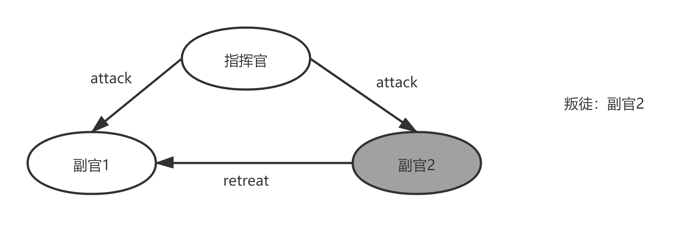
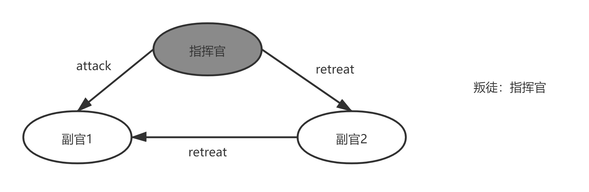
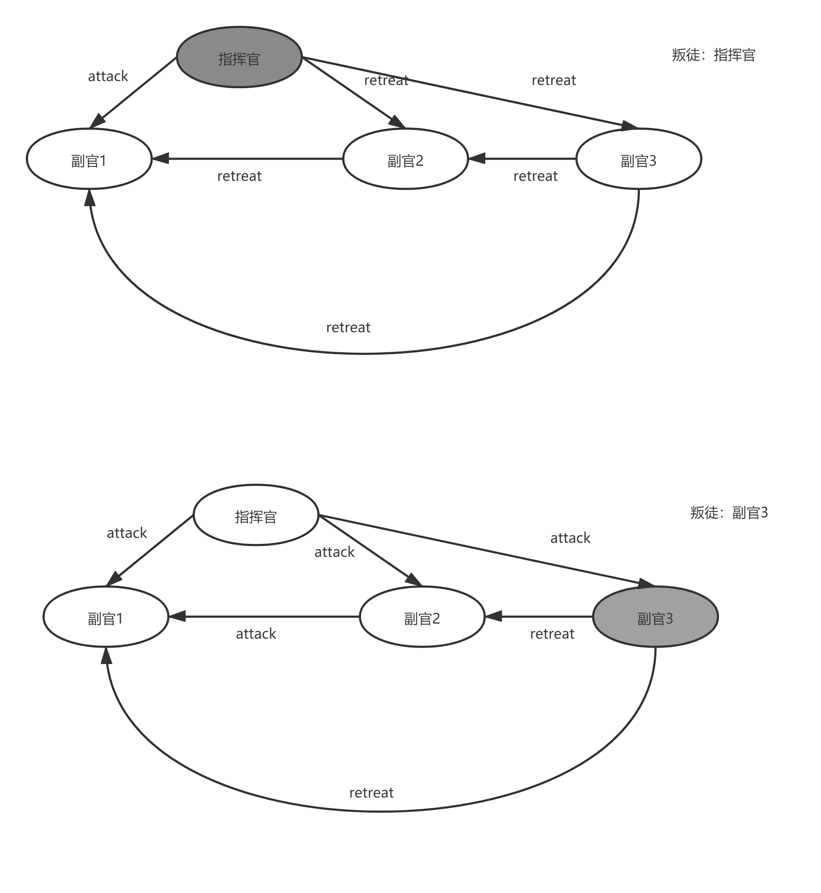
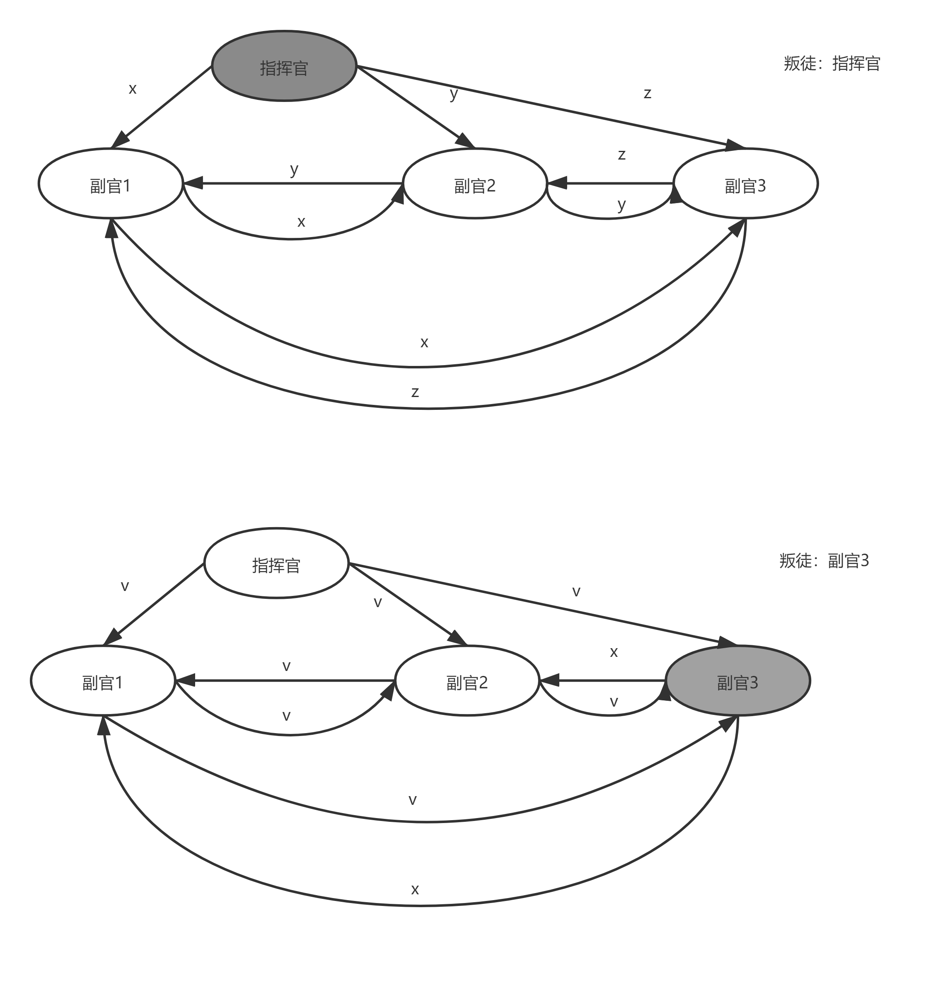
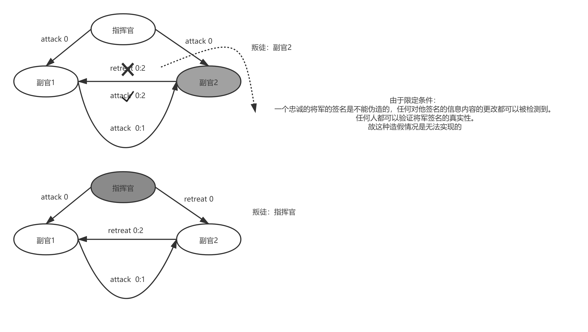

## 简述

这种情况可以抽象地表达为一群拜占庭军队的将军和他们的军队驻扎在敌人的城市周围。因此，在一个叛徒面前，没有解决三个将军的办法，将军们只能通过信使交流，必须商定一个共同的作战计划。然而，其中一个或多个可能是叛徒，他们会试图混淆其他人。问题是找到一种算法来确保忠诚的将军们达成一致。研究表明，仅使用口头信息，这个问题是可以解决的，当且仅当超过三分之二的将军是忠诚的;所以一个叛徒可以迷惑两个忠诚的将军。有了不可伪造的文字信息，这个问题对任何数量的将军和可能的叛徒来说都是可以解决的。然后讨论了这些解决方案在可靠计算机系统中的应用。

## 解决目标问题

可靠的计算机系统必须处理故障部件，这些部件向系统的不同部分提供相互冲突的信息。

即解决冲突信息，思想仍然是少数服从多数。

## 目标

找到一种合适的算法确保忠诚的将军能达到意见一致

## 达到目标的条件

- ***A  所有忠诚的将军都决定同样的行动计划。***
- ***B  一小撮叛徒不能使忠诚的将军们采纳一个坏计划。***

描述：条件***B***很难形式化，因为它要求准确地说出什么是糟糕的计划，而我们并不打算这样做。相反，我们考虑将军们如何做出决定。每个将军都观察敌人，并把他的观察结果传达给其他人。设v(i)为第i个将军传达的信息。每个一般使用一些方法来组合值***v (1) .....V (n)***变成一个单独的行动计划，其中***n***是将军的数目。条件A是通过让所有将军使用相同的方法来组合信息来实现的，条件B是通过使用一种鲁棒方法来实现的。例如，如果要做的唯一决定是进攻还是撤退，那么***v(i)***就是***i***将军的意见，即哪个选择是最好的，而最终的决定可以基于他们中的大多数人的投票。只有当忠诚的将军们在两种可能性中几乎平分，少数卖国贼才能影响决策，在这种情况下，任何一个决定都不能被称为坏决定。虽然这种方法可能不是满足条件A和B的唯一方法，但它是我们所知道的唯一方法。它采用了一种方法，将军们通过这种方法互相交流他们的价值观***v (i)***。显而易见的方法是第i个将军通过信使发送***v (i)***给对方将军。但是，这是行不通的，因为满足条件***A***要求每个忠诚的将军获得相同的值***v(1) .....V (n)***，一个叛国的将军可能会给不同的将军发送不同的值。要满足条件***A***，下列条件必须成立

1. 每个忠诚的将军必须获得相同的信息***v (1) ....v (n)***。

   条件1意味着将军不能使用直接从第i将军获得的值***v(i)***，因为叛变的第i将军可以将不同的值发送给不同的将军。这意味着，除非我们小心，在满足条件1的情况下，我们可能引入一种可能性，即将军使用的***v (i)***值与第***i***个将军发送的值不同——即使第***i***个将军是忠诚的。如果满足条件***B***，我们绝不允许这种情况发生。例如，我们不能允许少数卖国贼使洛亚将军以“撤退”的价值作决定，……如果每一个忠诚的将军都派人去“进攻”的话。因此，我们对每个i都有以下要求
2. 如果第i个将军是忠诚的，那么他发送的值必须被每个忠诚的将军用作***v (i)***的值。

我们可以将条件I重写为条件对于每一个I(无论第I个将军是否忠诚)：1”.任何两个忠诚的将军使用相同的***v(i)***值。

条件1'和2都是第***i***个将军发送的单个值的条件。因此，我们可以把我们的考虑限制在一个将军如何将他的价值传递给其他将军的问题上。我们用一个指挥将军向他的副官们发出命令的方式来描述这个问题。

最终拜占庭将军的问题变成下面这样一个命题
一个将军必须向他的***n - 1***个中将发出这样的命令
对于命令的要求：

- ***IC1 所有忠诚的中尉都服从同一命令***
- ***IC2 如果指挥官是忠诚的，那么每个忠诚的中尉都会服从他的命令。***
  
  条件***IC1***和***IC2***称为交互一致性条件。注意，如果指挥官是忠诚的，***IC1***就会跟着***IC2***。然而，指挥官不需要忠诚。为了解决我们最初的问题，第i个将军通过使用拜占庭将军问题的解发送他的***v(i)***值命令“使用***v(i)***作为我的值”，其他将军作为副手。

## 不可能的结果

  拜占庭将军问题看似简单。令人惊讶的事实表明，如果将军们只能发出口头信息，那么除非超过三分之二的将军是忠诚的，否则任何解决方案都不会奏效。特别是，在只有三个将军的情况下，在一个叛徒面前，任何解决方案都不可能奏效。口头信息的内容完全在发送者的控制之下，所以一个叛逆的发送者可以传递任何可能的信息。**这样的消息与计算机通常相互发送的消息类型相对应。在第4节中，我们考虑了签名的、书面的消息，但这是不正确的。（Such a message corresponds to the type of message that computers normally send to one another. In Section 4 we consider signed, written messages, for which this is not true. 没读懂最后这个not true是啥意思，目测是指这样的简单的论证不严谨）**我们现在的情况是，光靠口头讲话，三个将军是对付不了一个叛徒的。为简单起见，我们考虑在这种情况下，唯一可能的决定是“进攻”或“撤退”。

- ### 情景1
  
  让我们首先检查图1所示的场景，在这个场景中，指挥官是忠诚的，并发出了“攻击”命令，但中尉2是叛徒，并向中尉1报告他收到了“撤退”命令。为了满足IC2，中尉1必须服从攻击命令。

- ### 情景2
  
  在这个场景中，指挥官是叛徒，向中尉1发送“攻击”命令，向中尉2发送“撤退”命令。中尉1不知道叛徒是谁，他也不知道指挥官实际上给中尉2发了什么信息。因此，在中尉1看来，这两幅图中的场景完全相同。如果叛徒总是撒谎，那么中尉1就没有办法区分这两种情况，所以他必须在这两种情况下都服从“进攻”命令。因此，每当中尉接到指挥官下达的“进攻”命令时，他必须服从。同样的，如果中尉2从指挥官那里收到“撤退”命令，那么即使中尉1告诉他指挥官说“进攻”，他也必须服从。因此，在图2的场景中，中尉2必须服从“撤退”命令，而中尉1服从“进攻”命令，从而违反条件***IC1***。因此，在一个叛徒面前，没有解决三个将军的办法。

  这个论点似乎很有说服力，但我们强烈建议读者对这种非严密的推理持怀疑态度。虽然这个结果确实是正确的，但这个证明过程是非常不严谨的。严格证明3将军中带一个叛徒的问题是无解的，请参阅论文***PEASE, M., SHOSTAK, R., AND LAMPORT, L. Reaching agreement in the presence of faults. J.ACM 27, 2 (Apr. 1980), 228-234.***

从结论来看，设有***m***个叛徒则要保证忠诚将士最后信息的一致，至少要求有***3m+1***个节点如下图根据少数服从多数，最后忠诚的将士总能达成信息的一致

## 解决拜占庭问题的算法

1. ### 口头信息算法

   **口头信息的定义在将军信息系统中的体现:**

  *** A1.发送的每个消息都正确地传递。***

   ***A2.信息的接收者知道是谁发送的。***

2.*** A3.可以检测到没有消息。***

   **定义：**

   我们归纳定义了口头信息算法***OM(m)***，对于所有非负整数***m***，指挥官向***n - 1***个中尉发送命令。我们证明***OM(m)***解决了***3m+ 1***或更多的将军在最多m个卖国贼在场的情况下的拜占庭将军问题。我们发现用副手“获取一个值”而不是“服从一个命令”来描述这个算法更方便。算法假定函数***majority***具有这样的属性:如果大多数值***vi***等于***v***，则***majority (Vl，..， v，-D = v***(实际上，它假设一个这样的函数序列——每个***n***对应一个)。对于majority的值有两个自然的选择***(v1，…, v, 1)***：

   1）***vi***中的大多数值如果存在，则返回值

   2）***vi***的中值（**序列中间的顺序的值？**），假设它们来自有序集。

   **算法描述：**

   ***OM(0) ,m=0***,即没有叛徒的时候

   (1)司令员把他的价值发给每个中尉。

   (2)每个中尉使用他从指挥官那里得到的值，或者如果他没有得到值就使用撤退值。

   ***OM(m),m>0***,有***m***个叛徒的时候。

   (1)指挥官把他的价值发给每个中尉。

   (2)对于每一个***i***，让***vi***作为中尉从指挥官那里得到的价值，否则，如果他没有价值，就撤退。中尉***i***作为***OM(m - 1)***算法的指挥官，将值***vi***发送给其他***n - 2***个中尉。

   (3)对于每个***i***和每个***j ~ i***，让***vj***为中尉***i***在step(2)(使用***OM(m - 1)***算法)中从中尉j接收到的值，或者如果没有接收到该值则撤退。中尉i使用值多数***(vl .....v, 1)***。

   **引理1：对于任意***m***，如果有***3m***以上的将军，最多***m***个叛徒，则***OM (m)***算法满足***IC1***和***IC2***条件。**

   如图：

   上图：副官1、2、3：结果集result均为（x,y,z）

   下图：副官1、2、3：结果集result均为（v,v,x）=>均为v

## 

2. ## 签名信息算法

   A1.发送的每个消息都正确地传递。
   A2.信息的接收者知道是谁发送的。
   A3.可以检测到没有消息。
   A4.(a)一个忠诚的将军的签名是不能被伪造的，他的签名信息内容的任何改变都可以被检测到
     (b)任何人都可以验证将军签名的真实性

   **请注意，我们对一个叛国将军的签名没有任何假设。特别是，我们允许另一个卖国贼伪造他的签名，从而允许卖国贼相互勾结。引入了签名消息后，不再需要3m+1个将军来解决m个判读的问题了，m叛徒问题是有解的(m为任意数)，但前提是至少得有m+2个将军**

   **算法概述：**

   指挥官给他的每个中尉都发了一份签过字的命令。然后每个中尉将自己的签名添加到命令中，并将其发送给其他中尉，后者将自己的签名发送给其他人，以此类推。这意味着一名中尉必须有效地接收一份已签名的信息，将其复制几份，并签署并发送这些副本。如何获得这些副本并不重要;单个消息可能被影印，或者每个消息可能由一堆相同的消息组成，这些消息根据需要被签名和分发。

   **算法定义:**

   设***x: i***标记值***x***被将军***i***签名，因此，***v:j: i***标记值***v***先被***j***签名，然后是值***v:j***被***i***标记。我们让将军0表示指挥官。在这个算法中，每个中尉***i***维护一个集合***Vi***，其中包含他到目前为止收到的正确签名的命令集。(如果指挥官是忠诚的，那么这个集合就不应该包含超过一个元素。)不要将他收到的命令集Vi与他收到的消息集混淆，因为存在有消息不同但命令相同的情况。

   **算法描述:**

   ***SM(m)***

   初始化：***V_i*** = ***\varnothing***

   (1)指挥官签字，并把他的价值发给每个中尉。

   (2) 对于任意中尉***i***来说：

  (A)如果中尉***i***从指挥官那里收到***v: 0***格式的信息，而他还没有收到任何命令，那么

  (i)***V_i*** = ***\{v\}***

  (ii)将信息***v:0:i***发送给其他的中尉

  (B)如果中尉接受一个形式是***v:0:j_i:...:j_k***同时***v***不在数据集***Vi***，然后

  (i)将***v***添加到数据集***V_i***

  (ii)如果***k<m***然后将信息***v:0:j_i:...:j_k:i***发给除了***j_i:...:j_k***的其他中尉

  (3)对于任意中尉***i***来说，当中尉***i***没有收到更多的信息，将服从命令choice(Vi)。

  注意：

  步骤(2)中任意中尉***i***，所有命令相同(均为***v***)的信息,若命令***v***已经在***V***中，则无视这些信息

  步骤(2)将抛出所有不带验证信息即签名的数据包

  引理2：***\forall m***,***SM(m)***算法能解决至多***m***个叛徒的拜占庭问题

  要求：

   1)如果结果集***V***只有单个元素***v***组成，则***chioce(V)=v***

   2)***chioce(\varnothing)= RESTREAT***

   如图***SM(1)***

   

3. ### 没有直接沟通的路径

   如果将军的图***G***是***3m***正则的，则在***m***叛徒存在的情况下解决拜占庭将军问题。(注意，一个***3m***规则图必须包含至少***3m + 1***个节点。对于所      有正整数***m***和***p***，当一般图***G***为正则时，定义算法***OM(m, p)***如下:(如果***G***不是正则的，则***OM(m,p)***没有定义。)定义使用了对***m***的归纳法。

  引理3 ***\forall m>0***,***p>=3m***,算法***OM(m,p)***在最多***m***个叛徒的前提下能解决拜占庭问题

  引理4***\forall m,p***，如果拥有至多***m***个叛徒且忠诚将军的子图直径为d（注：图直径的最小值d是任意两个节点连线最短的那条）

**注：正则图的概念在图论中，正则图中每个顶点具有相同数量的邻点； 即每个顶点具有相同的度或价态。 正则的有向图也必须满足更多的条件，即每个顶点的内外自由度都要彼此相等。具有k个自由度的顶点的正则图被称为k度的k-正则图。 此外，奇数程度的正则图形将包含偶数个顶点。**
