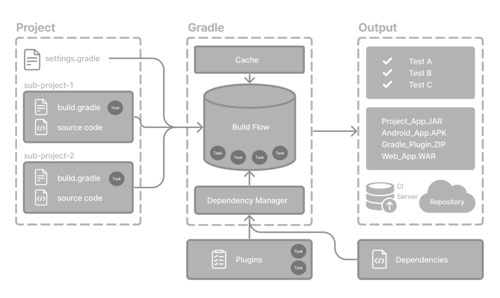
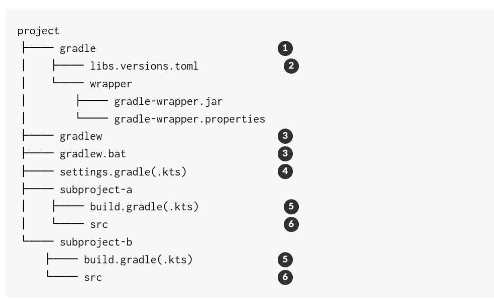

# Gradle 基础

原文出自官方文档[Gradle Basics](https://docs.gradle.org/current/userguide/gradle_basics.html)

Gradle 可根据**构建脚本**中的信息**自动构建、测试和部署软件**.

## 总体业务架构



对文字的解释：

- 业务包含三部分**项目Project、构建工具Gradle和输出Output**。项目作为输入经过构建工具后得到输出。

- 项目部分：一个项目可以有多个子项目。根项目中会包含一个`setting.gradle`文件，子项目包含`build.gradle`和源码文件。
- 构建工具部分：包含缓存`Cache`、构建工作流`Build Flow`和依赖管理`Dependency Manager`。根据引入插件`Plugins`添加默认的构建工作流、和引入的依赖项添加依赖
- 输出部分：包含测试结果、项目包和与服务器持续集成的操作。

## Gradle 名词解释

### Project 项目

Gradle **项目**是可以构建的软件，例如应用程序或库。

**单个项目**生成包括一个名为**根项目的**单个项目。

**多项目**生成包括**一个根项目**和**任意数量的子项目**。

### Build Scripts 构建脚本集

**构建脚本**向 Gradle 详细介绍了构建项目需要执行哪些步骤。

每个项目可以包含一个或多个生成脚本。

### Dependency Manager 依赖关系管理

**依赖项管理**是一种自动化技术，用于声明和解析项目所需的外部资源。

每个项目通常都包含许多外部依赖项，Gradle 将在构建过程中解决这些依赖项。

### Task 任务

**任务是基本工作单元**，例如编译代码或运行测试。

每个项目都包含在构建脚本或插件中定义的一个或多个任务。

### Plugins 插件

插件用于**扩展 Gradle 的功能**，并选择性地为项目贡献**任务**。

## Gradle 项目结构



1. 存放gradle wrapper文件和其他相关文件的地方。
2. 用于依赖项的版本管理
3. 执行wrapper的脚本
4. 定义跟项目名称并导入子项目
5. 子项目的构建脚本
6. 子项目的源码

## 命令行接口

参考官网[Command-Line Interface Basics (gradle.org)](https://docs.gradle.org/current/userguide/command_line_interface_basics.html)

## Setting.gradle

```
rootProject.name = 'root-project'   //项目名称
include('sub-project-a') //引入子项目            
include('sub-project-b')
include('sub-project-c')
```

## Build.gradle

```
plugins {
    id 'application'                
}

application {
    mainClass = 'com.example.Main'  
}
```

