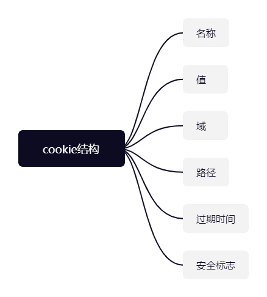

## Section 25 客户端存储

js为什么会涉及到客户端存储呢？

**目标**：将不常更新、且相对公用的数据存储在客户端中，减少与服务端的交互，提高整体的性能。

## cookie

原始目标：
要求HTTP头部包含会话信息。

### cookie具有局限性

**浏览器级别的局限性：**

1. 不超过300个cookie
2. 每个cookie不超过4096字节
3. 每个域不超过20个cookie
4. 每个域不超过81920字节。

**域级别的局限性：**

| 浏览器         | 每个域的cookie限制 |
| -------------- | ------------------ |
| Edge           | 不超过50           |
| Firefox        | 不超过150个        |
| Opera          | 不超过180个        |
| Safari和Chrome | 没有硬性限制       |

**浏览器对于cookie的过限处理：**

如果cookie总数超过了单域上限，浏览器会删除之前设置的cookie。

- Opera的处理策略是最少使用删除原则
- Firefox是随机删除原则

### cookie构成

- 名称：cookie的唯一可标识，且不区分大小写，cookie名称必须经过URL编码。

- 值：存储在cookie里的字符串值，值也必须经过URL编码

- 域：cookie的有效域。发送到这个域的所有请求都会包含对应的cookie

- 路径：请求URL中包含这个路径才会把cookie发送到服务器。

- 过期时间：表示何时删除cookie的时间戳。

  删除策略：

  - 删除cookie
