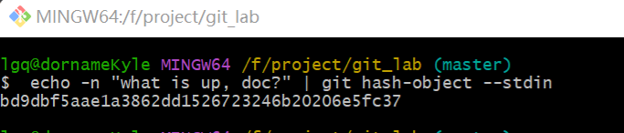

# **Git原理学习**

## Git对象

***Git***是一个内容寻址文件系统。其核心思想就是键值对数据库（***key-value data store***），其核心行为包括：

1. 通过向 ***Git*** 仓库中插入任意类型的内容，它会返回一个唯一的键（***key***）。
2. 通过该键可以在任意时刻再次取回该内容。

### 实验出真知

可以通过底层命令 `git hash-object` 来演示上述效果——该命令可将任意数据保存于 .git/objects 目录（即 **对象数据库**），并返回指向该数据对象的唯一的键。

1. 初始化一个***Git***仓库

   ```
   $ git init git_lab
   ```

2. 检查一下***git***对象目录(`.git/objects`)生成了哪些文件夹，通过`find`命令查看所有文件夹（包含子文件夹）

   ```
   $ find .git/objects/
   .git/objects/
   .git/objects/info
   .git/objects/pack
   ```

3. 检查一下`.git/objects`目录下生成了哪些文件，同样通过`find`+文件路径+类型参数`-type f`查看所有文件

   ```
   $ find .git/objects/ -type f
   //无输出表示没有文件
   ```

4. 接下来要开始创建并保存一个文件了，这里简单创建一个文本文件

   ```
   echo "git testing" > git_test.txt
   ```

5. 保存到***git***对象目录（`.git/objects`）。这里使用了`git hash-object`命令，根据文件`git_test.txt`的内容生成一串`hash`值

   ```
   git hash-object -w git_test.txt
   34e75148c0aeb4efb212f817606d386b15190525
   ```

   **注意：hash值仅与文件内容有关，与名称无关。**

   ```
   $ echo "git testing" | git hash-object -w --stdin
   34e75148c0aeb4efb212f817606d386b15190525
   ```

6. 再次查看***git***对象目录（`.git/objects`）下的所有文件

   ```
   $ find .git/objects/ -type f
   .git/objects/34/e75148c0aeb4efb212f817606d386b15190525
   ```

   其中`hash`值长度40，前两个字符用于子目录命名，后38个字符用于文件命名。***hash算法参考SHA-1***

7. 文件`git_test.txt`内容已经存储到对象数据库中，如果需要从***git***中取回数据，则需要通过`cat-file`命令实现（个人理解`cat`实际就是`catch`的缩写），其中指定 `-p` 选项可指示该命令自动判断内容的类型，并为我们显示大致的内容

   ```
   $ git cat-file -p 34e75148c0aeb4efb212f817606d386b15190525
   git testing
   ```

8. 版本变更实验：更新文件`git_test.txt`的内容并重新保存

   ```
   $ echo "changing" > git_test.txt
   $ git hash-object -w git_test.txt
   372991728e3348b2c32b8dd5377885f2f77173ff
   ```

9. 查看对象数据库生成文件内容，它记录了该文件的两个不同版本。

   ```
   $ find .git/objects/ -type f
   .git/objects/34/e75148c0aeb4efb212f817606d386b15190525
   .git/objects/37/2991728e3348b2c32b8dd5377885f2f77173ff
   ```

10. 删除`git_test.txt`文件，然后尝试回归到第一个版本

    ```
    $ rm git_test.txt
    $ git cat-file -p 34e75148c0aeb4efb212f817606d386b15190525 > git_test.txt
    ```

**这里面其实有个问题：记住文件的每一个版本所对应的 SHA-1 值并不现实；另一个问题是，在这个（简单的版本控制）系统中，文件名并没有被保存——我们仅保存了文件的内容。**

 上述类型的对象我们称之为 **数据对象（blob object**）。 利用 `git cat-file -t` 命令，可以让 ***Git*** 告诉我们其内部存储的任何对象类型，只要给定该对象的 ***SHA-1*** 值：

```
$ git cat-file -t 372991728e3348b2c32b8dd5377885f2f77173ff
blob
```

### 树对象

**为了记住每个文件的文件名，GIt引入了树对象**

**树对象的目标**：解决文件名保存的问题。

下面主要介绍如何创建一个树对象 ：

创建一个树对象。创建一个树对象首先需要通过暂存一些文件来创建一个暂存区。 可以通过底层命令` git update-index` 为一个单独文件 text.txt 文件的指定版本创建一个暂存区，其中必须指定`--add`选项。而`--cacheinfo`选项，则是当添加的文件来源于**Git**数据库中时需要指定的选项。

`````` 
git update-index --add --cacheinfo 100644 \{文件对象hash} 文件名称
``````

```
git update-index --add --cacheinfo 100644 \34e75148c0aeb4efb212f817606d386b15190525 git_test.txt
```

 写入暂存区之后，可以通过`write-tree`命令将暂存区内容写入一个树对象。

```
git write-tree
e6de8239772c2c63585dd11b283050631b7f3801
```

**注意：若是要将树对象写入暂存区则需要通过`read-tree`指令。通常用于将现有的特定树对象，加入到即将生成的新树对象中。**

检查当前对象的类型。
`git cat-file -t`

```
git cat-file -t e6de8239772c2c63585dd11b283050631b7f3801
tree
```

查看树对象的信息

```
git cat-file -p e6de8239772c2c63585dd11b283050631b7f3801
100644 blob 34e75148c0aeb4efb212f817606d386b15190525    git_test.txt
```

综上数据对象维护了文件的内容、树对象维护了文件名称（包含文件名称和文件内容的关系），从使用者的角度来说，我们不仅关心每一次提交的文件内容和文件名称同时我们还关心提交人、提交时间以及提交原因，即我们业务常说的维护人信息为了保存维护人信息，**Git**又引入了提交对象。

### 提交对象

提交对象的职责是管理和记录维护人信息，通过指令`commit-tree`来创建。

通过`commit-tree`指令，我们为一个树对象(tree object)创建一个提交对象。

```
git commit-tree e6de82 -m "first commit"
9a0035e9c8b72429ee2b78b7d4a5d4baaa7a0a53
git log 9a0035
commit 9a0035e9c8b72429ee2b78b7d4a5d4baaa7a0a53
Author: LiGuangQiao <lgqfighting@163.com>
Date:   Sat Sep 16 11:58:11 2023 +0800

    first commit
```

实际上每次我们运行 `git add` 和 `git commit` 命令时，Git 所做的工作实质就是将被改写的文件保存为数据对象，更新暂存区，记录树对象，最后创建一个指明了顶层树对象和父提交的提交对象。 这三种主要的 Git 对象——数据对象、树对象、提交对象——最初均以单独文件的形式保存在 `.git/objects` 目录下。 

## 对象存储结构

**Git**对象具备自己的存储策略，元数据结构如下：

```
#{对象类型} #{content.lenght}\0#{content}
```

例如：

```
"blob 16\u0000what is up, doc?"
```

元数据整体由头部信息和存储信息两部分组成，头部信息为对象类型和存储信息长度，最后添加上存储信息的内容。元数据类型为字符串。**Git**将头部信息的存储信息拼接起来后使用***SHA-1***计算一个*hash*值。
例子中的计算结果为

```
"bd9dbf5aae1a3862dd1526723246b20206e5fc37"
```

可使用`git hash-object`命令来做尝试。

**注意，请在git的自带工具中使用目前在`VSCODE`的命令行执行得到的结果是不一样的。具体什么原因还有待研究。**

```
echo -n "what is up, doc?" | git hash-object --stdin
"bd9dbf5aae1a3862dd1526723246b20206e5fc37"
```



上述内容只m是对存储内容转换成一个定长Hash，实际存储到磁盘上仍有后续处理包含压缩处理和分割存储处理。

- 压缩处理：目标是为了尽可能节省存储空间。**Git**选择的压缩库为`zlib`。上述例子的压缩结果为

  ```
   "x\x9CK\xCA\xC9OR04c(\xCFH,Q\xC8,V(-\xD0QH\xC9O\xB6\a\x00_\x1C\a\x9D"
  ```

- 分割存储处理：**Git**将存储内容写入磁盘的路径，是对hash值进行了分割，以前两个字符为子目录名称，后38个字符作为子目录内容的文件名称。目测是为了保证磁盘写入性能，由于没有做测试所以尚不清楚。

  ```
  ".git/objects/bd/9dbf5aae1a3862dd1526723246b20206e5fc37"
  ```

## Git引用

TODO

## 包文件

TODO

## 引用规范

TODO

## 传输协议

TODO

## 维护与数据恢复

TODO

## 环境变量

TODO

## 总结

TODO


