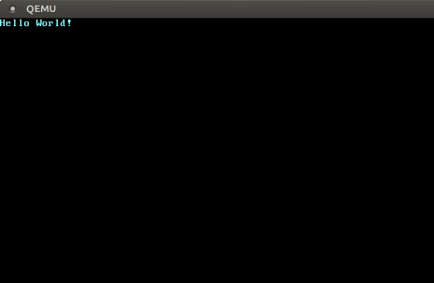

# 最小Rust内核

（[参考原作者phil的官方博客](https://os.phil-opp.com/zh-CN/minimal-rust-kernel/)）

## 启动进程

- 计算机开机时，它开始执行存储在主板 ROM 中的固件代码。 **启动进程**执行加电自检、检测可用 RAM 并预初始化 CPU 和硬件。 然后，它会查找可启动磁盘并开始启动操作系统内核。

- 在 x86 上，有两种固件标准：“基本输入/输出系统”(BIOS) 和较新的“统一可扩展固件接口”(UEFI)。 BIOS 标准陈旧且过时，但简单且自 20 世纪 80 年代以来的任何 x86 计算机都得到良好支持。 相比之下，UEFI 更现代，具有更多功能，但设置更复杂。目前UEFI，作者已经开始支持了，详细进度去看作者的github仓库或者相关新的博客。

**启动进程的具体流程：**

当您打开计算机时，它会从主板上的某些特殊闪存加载 BIOS。 BIOS 运行硬件的自检和初始化例程，然后查找可启动磁盘。 如果找到，控制权就会转移到其引导加载程序，这是存储在磁盘开头的 512 字节可执行代码部分。 大多数引导加载程序都大于 512 字节，因此引导加载程序通常分为较小的第一阶段（适合 512 字节）和第二阶段（随后由第一阶段加载）。 引导加载程序必须确定内核映像在磁盘上的位置并将其加载到内存中。 它还需要先将CPU从16位实模式切换到32位保护模式，然后再切换到64位长模式，其中64位寄存器和完整的主存储器都可用。 它的第三项工作是从 BIOS 查询某些信息（例如内存映射）并将其传递给操作系统内核。 编写引导加载程序有点麻烦，因为它需要汇编语言和许多非深入的步骤，例如“将这个神奇的值写入该处理器寄存器”。 因此，我们不会在本文中介绍引导加载程序的创建，而是提供一个名为 bootimage 的工具，该工具会自动将引导加载程序添加到内核中。 

## 内核构建

主要包含4个部分

1. 下载`nightly`版本的Rust
2.  项目配置清单
3.  编译内核
4.  向屏幕打印字符
5.  启动内核

### 项目配置清单

通过 `--target` 参数，`cargo` 支持不同的目标系统。这个目标系统可以使用一个**目标三元组**（[target triple](https://clang.llvm.org/docs/CrossCompilation.html#target-triple)）来描述，它描述了 CPU 架构、平台供应者、操作系统和**应用程序二进制接口**（[Application Binary Interface, ABI](https://stackoverflow.com/a/2456882)）。比方说，目标三元组` x86_64-unknown-linux-gnu` 描述一个基于 `x86_64` 架构 CPU 的、没有明确的平台供应者的 linux 系统，它遵循 GNU 风格的 ABI。Rust 支持[许多不同的目标三元组](https://forge.rust-lang.org/release/platform-support.html)，包括安卓系统对应的 `arm-linux-androideabi` 和 [WebAssembly使用的wasm32-unknown-unknown](https://www.hellorust.com/setup/wasm-target/)。

为了编写我们的目标系统，并且鉴于我们需要做一些特殊的配置（比如没有依赖的底层操作系统），[已经支持的目标三元组](https://forge.rust-lang.org/release/platform-support.html)都不能满足我们的要求。幸运的是，只需使用一个 JSON 文件，Rust 便允许我们定义自己的目标系统；这个文件常被称作**目标配置清单**（target specification）。比如，一个描述 `x86_64-unknown-linux-gnu` 目标系统的配置清单大概长这样：

```toml
{
    "llvm-target": "x86_64-unknown-linux-gnu",
    "data-layout": "e-m:e-i64:64-f80:128-n8:16:32:64-S128",
    "arch": "x86_64",
    "target-endian": "little",
    "target-pointer-width": "64",
    "target-c-int-width": "32",
    "os": "linux",
    "executables": true,
    "linker-flavor": "gcc",
    "pre-link-args": ["-m64"],
    "morestack": false
}
```

一个配置清单中包含多个**配置项**（field）。大多数的配置项都是 LLVM 需求的，它们将配置为特定平台生成的代码。打个比方，`data-layout` 配置项定义了不同的整数、浮点数、指针类型的长度；另外，还有一些 Rust 用作条件编译的配置项，如 `target-pointer-width`。还有一些类型的配置项，定义了这个包该如何被编译，例如，`pre-link-args` 配置项指定了应该向**链接器**（[linker](https://en.wikipedia.org/wiki/Linker_(computing))）传入的参数。

我们将把我们的内核编译到 `x86_64` 架构，所以我们的配置清单将和上面的例子相似。现在，我们来创建一个名为 `x86_64-blog_os.json` 的文件——当然也可以选用自己喜欢的文件名——里面包含这样的内容：

```toml
{
    "llvm-target": "x86_64-unknown-none",
    "data-layout": "e-m:e-i64:64-f80:128-n8:16:32:64-S128",
    "arch": "x86_64",
    "target-endian": "little",
    "target-pointer-width": "64",
    "target-c-int-width": "32",
    "os": "none",
    "executables": true
}
```

需要注意的是，因为我们要在**裸机**（bare metal）上运行内核，我们已经修改了 `llvm-target` 的内容，并将 `os` 配置项的值改为 `none`。

我们还需要添加下面与编译相关的配置项:

```
"linker-flavor": "ld.lld",
"linker": "rust-lld",
```

在这里，我们不使用平台默认提供的链接器，因为它可能不支持 Linux 目标系统。为了链接我们的内核，我们使用跨平台的 **LLD链接器**（[LLD linker](https://lld.llvm.org/)），它是和 Rust 一起打包发布的。

```
"panic-strategy": "abort",
```

这个配置项的意思是，我们的编译目标不支持 panic 时的**栈展开**（[stack unwinding](https://www.bogotobogo.com/cplusplus/stackunwinding.php)），所以我们选择直接**在 panic 时中止**（abort on panic）。这和在 `Cargo.toml` 文件中添加 `panic = "abort"` 选项的作用是相同的，所以我们可以不在这里的配置清单中填写这一项。

```
"disable-redzone": true,
```

我们正在编写一个内核，所以我们迟早要处理中断。要安全地实现这一点，我们必须禁用一个与**红区**（redzone）有关的栈指针优化：因为此时，这个优化可能会导致栈被破坏。如果需要更详细的资料，请查阅我们的一篇关于 [禁用红区](https://os.phil-opp.com/zh-CN/red-zone/) 的短文。

```
"features": "-mmx,-sse,+soft-float",
```

`features` 配置项被用来启用或禁用某个目标 **CPU 特征**（CPU feature）。通过在它们前面添加`-`号，我们将 `mmx` 和 `sse` 特征禁用；添加前缀`+`号，我们启用了 `soft-float` 特征。

`mmx` 和 `sse` 特征决定了是否支持**单指令多数据流**（[Single Instruction Multiple Data，SIMD](https://en.wikipedia.org/wiki/SIMD)）相关指令，这些指令常常能显著地提高程序层面的性能。然而，在内核中使用庞大的 SIMD 寄存器，可能会造成较大的性能影响：因为每次程序中断时，内核不得不储存整个庞大的 SIMD 寄存器以备恢复——这意味着，对每个硬件中断或系统调用，完整的 SIMD 状态必须存到主存中。由于 SIMD 状态可能相当大（512~1600 个字节），而中断可能时常发生，这些额外的存储与恢复操作可能显著地影响效率。为解决这个问题，我们对内核禁用 SIMD（但这不意味着禁用内核之上的应用程序的 SIMD 支持）。

禁用 SIMD 产生的一个问题是，`x86_64` 架构的浮点数指针运算默认依赖于 SIMD 寄存器。我们的解决方法是，启用 `soft-float` 特征，它将使用基于整数的软件功能，模拟浮点数指针运算。

为了让读者的印象更清晰，我们撰写了一篇关于 [禁用 SIMD][disabling SIMD](https://os.phil-opp.com/zh-CN/disable-simd/) 的短文。

现在，我们将各个配置项整合在一起。我们的目标配置清单应该长这样：

```toml
{
    "llvm-target": "x86_64-unknown-none",
    "data-layout": "e-m:e-i64:64-f80:128-n8:16:32:64-S128",
    "arch": "x86_64",
    "target-endian": "little",
    "target-pointer-width": "64",
    "target-c-int-width": "32",
    "os": "none",
    "executables": true,
    "linker-flavor": "ld.lld",
    "linker": "rust-lld",
    "panic-strategy": "abort",
    "disable-redzone": true,
    "features": "-mmx,-sse,+soft-float"
}
```

### 编译内核

要编译我们的内核，我们将使用 Linux 系统的编写风格（这可能是 LLVM 的默认风格）。这意味着，我们需要把[前一篇文章](https://os.phil-opp.com/freestanding-rust-binary/)中编写的入口点重命名为 `_start`：

```rust
// src/main.rs

#![no_std] // 不链接 Rust 标准库
#![no_main] // 禁用所有 Rust 层级的入口点

use core::panic::PanicInfo;

/// 这个函数将在 panic 时被调用
#[panic_handler]
fn panic(_info: &PanicInfo) -> ! {
    loop {}
}

#[no_mangle] // 不重整函数名
pub extern "C" fn _start() -> ! {
    // 因为编译器会寻找一个名为 `_start` 的函数，所以这个函数就是入口点
    // 默认命名为 `_start`
    loop {}
}
```

注意的是，无论你开发使用的是哪类操作系统，你都需要将入口点命名为 `_start`。前一篇文章中编写的 Windows 系统和 macOS 对应的入口点不应该被保留。

通过把 JSON 文件名传入 `--target` 选项，我们现在可以开始编译我们的内核。让我们试试看：

```
> cargo build --target x86_64-blog_os.json

error[E0463]: can't find crate for `core` 
```

毫不意外的编译失败了，错误信息告诉我们编译器没有找到 [`core`](https://doc.rust-lang.org/nightly/core/index.html) 这个crate，它包含了Rust语言中的部分基础类型，如 `Result`、`Option`、迭代器等等，并且它还会隐式链接到 `no_std` 特性里面。

通常状况下，`core` crate以**预编译库**（precompiled library）的形式与 Rust 编译器一同发布——这时，`core` crate只对支持的宿主系统有效，而对我们自定义的目标系统无效。如果我们想为其它系统编译代码，我们需要为这些系统重新编译整个 `core` crate。

为了解决上述问题需要使用

#### `build-std`选项

此时就到了cargo中 [`build-std` 特性](https://doc.rust-lang.org/nightly/cargo/reference/unstable.html#build-std) 登场的时刻，该特性允许你按照自己的需要重编译 `core` 等标准crate，而不需要使用Rust安装程序内置的预编译版本。 但是该特性是全新的功能，到目前为止尚未完全完成，所以它被标记为 “unstable” 且仅被允许在 [nightly Rust 编译器][nightly Rust compilers] 环境下调用。

要启用该特性，你需要创建一个 [cargo 配置](https://doc.rust-lang.org/cargo/reference/config.html) 文件，即 `.cargo/config.toml`，并写入以下语句：

```toml
# in .cargo/config.toml

[unstable]
build-std = ["core", "compiler_builtins"]
```

在设定 `unstable.build-std` 配置项并安装 `rust-src` 组件之后，我们就可以开始编译:

```
> cargo build --target x86_64-blog_os.json
   Compiling core v0.0.0 (/…/rust/src/libcore)
   Compiling rustc-std-workspace-core v1.99.0 (/…/rust/src/tools/rustc-std-workspace-core)
   Compiling compiler_builtins v0.1.32
   Compiling blog_os v0.1.0 (/…/blog_os)
    Finished dev [unoptimized + debuginfo] target(s) in 0.29 secs
```

在执行 `cargo build` 之后， `core`、`rustc-std-workspace-core` （`compiler_builtins` 的依赖）和 `compiler_builtins` crate被重新编译了。

#### 内存相关函数

目前来说，Rust编译器假定所有内置函数（`built-in functions`）在所有系统内都是存在且可用的。事实上这个前提只对了一半， 绝大多数内置函数都可以被 `compiler_builtins` 提供，而这个crate刚刚已经被我们重编译过了，然而部分内存相关函数是需要操作系统相关的标准C库提供的。 比如，`memset`（该函数可以为一个内存块内的所有比特进行赋值）、`memcpy`（将一个内存块里的数据拷贝到另一个内存块）以及`memcmp`（比较两个内存块的数据）。 好在我们的内核暂时还不需要用到这些函数，但是不要高兴的太早，当我们编写更丰富的功能（比如拷贝数据结构）时就会用到了。

现在我们当然无法提供操作系统相关的标准C库，所以我们需要使用其他办法提供这些东西。一个显而易见的途径就是自己实现 `memset` 这些函数，但不要忘记加入 `#[no_mangle]` 语句，以避免编译时被自动重命名。 当然，这样做很危险，底层函数中最细微的错误也会将程序导向不可预知的未来。比如，你可能在实现 `memcpy` 时使用了一个 `for` 循环，然而 `for` 循环本身又会调用 [`IntoIterator::into_iter`](https://doc.rust-lang.org/stable/core/iter/trait.IntoIterator.html#tymethod.into_iter) 这个trait方法，这个方法又会再次调用 `memcpy`，此时一个无限递归就产生了，所以还是使用经过良好测试的既存实现更加可靠。

幸运的是，`compiler_builtins` 事实上自带了所有相关函数的实现，只是在默认情况下，出于避免和标准C库发生冲突的考量被禁用掉了，此时我们需要将 [`build-std-features`](https://doc.rust-lang.org/nightly/cargo/reference/unstable.html#build-std-features) 配置项设置为 `["compiler-builtins-mem"]` 来启用这个特性。如同 `build-std` 配置项一样，该特性可以使用 `-Z` 参数启用，也可以在 `.cargo/config.toml` 中使用 `unstable` 配置集启用。现在我们的配置文件中的相关部分是这样子的：

```toml
# in .cargo/config.toml

[unstable]
build-std-features = ["compiler-builtins-mem"]
build-std = ["core", "compiler_builtins"]
```

（`compiler-builtins-mem` 特性是在 [这个PR](https://github.com/rust-lang/rust/pull/77284) 中被引入的，所以你的Rust nightly更新时间必须晚于 `2020-09-30`。）

该参数为 `compiler_builtins` 启用了 [`mem` 特性](https://github.com/rust-lang/compiler-builtins/blob/eff506cd49b637f1ab5931625a33cef7e91fbbf6/Cargo.toml#L54-L55)，至于具体效果，就是已经在内部通过 `#[no_mangle]` 向链接器提供了 [`memcpy` 等函数的实现](https://github.com/rust-lang/compiler-builtins/blob/eff506cd49b637f1ab5931625a33cef7e91fbbf6/src/mem.rs#L12-L69)。

经过这些修改，我们的内核已经完成了所有编译所必需的函数，那么让我们继续对代码进行完善。

#### 设置默认编译目标

每次调用 `cargo build` 命令都需要传入 `--target` 参数很麻烦吧？其实我们可以复写掉默认值，从而省略这个参数，只需要在 `.cargo/config.toml` 中加入以下 [cargo 配置](https://doc.rust-lang.org/cargo/reference/config.html)：

```toml
# in .cargo/config.toml

[build]
target = "x86_64-blog_os.json"
```

这个配置会告知 `cargo` 使用 `x86_64-blog_os.json` 这个文件作为默认的 `--target` 参数，此时只输入短短的一句 `cargo build` 就可以编译到指定平台了。如果你对其他配置项感兴趣，亦可以查阅 [官方文档](https://doc.rust-lang.org/cargo/reference/config.html)。

那么现在我们已经可以用 `cargo build` 完成程序编译了，然而被成功调用的 `_start` 函数的函数体依然是一个空空如也的循环，是时候往屏幕上输出一点什么了。

### 向屏幕打印字符

要做到这一步，最简单的方式是写入 **VGA 字符缓冲区**（[VGA text buffer](https://en.wikipedia.org/wiki/VGA-compatible_text_mode)）：这是一段映射到 VGA 硬件的特殊内存片段，包含着显示在屏幕上的内容。通常情况下，它能够存储 25 行、80 列共 2000 个**字符单元**（character cell）；每个字符单元能够显示一个 ASCII 字符，也能设置这个字符的**前景色**（foreground color）和**背景色**（background color）。

```rust
static HELLO: &[u8] = b"Hello World!";

#[no_mangle]
pub extern "C" fn _start() -> ! {
    let vga_buffer = 0xb8000 as *mut u8;

    for (i, &byte) in HELLO.iter().enumerate() {
        unsafe {
            *vga_buffer.offset(i as isize * 2) = byte;
            *vga_buffer.offset(i as isize * 2 + 1) = 0xb;
        }
    }

    loop {}
}
```

在这段代码中，我们预先定义了一个**字节字符串**（byte string）类型的**静态变量**（static variable），名为 `HELLO`。我们首先将整数 `0xb8000` **转换**（cast）为一个**裸指针**（[raw pointer](https://doc.rust-lang.org/1.30.0/book/second-edition/ch19-01-unsafe-rust.html#dereferencing-a-raw-pointer)）。这之后，我们迭代 `HELLO` 的每个字节，使用 [enumerate](https://doc.rust-lang.org/core/iter/trait.Iterator.html#method.enumerate) 获得一个额外的序号变量 `i`。在 `for` 语句的循环体中，我们使用 [offset](https://doc.rust-lang.org/std/primitive.pointer.html#method.offset) 偏移裸指针，解引用它，来将字符串的每个字节和对应的颜色字节——`0xb` 代表淡青色——写入内存位置。

要注意的是，所有的裸指针内存操作都被一个 **unsafe 语句块**（[unsafe block](https://doc.rust-lang.org/stable/book/second-edition/ch19-01-unsafe-rust.html)）包围。这是因为，此时编译器不能确保我们创建的裸指针是有效的；一个裸指针可能指向任何一个你内存位置；直接解引用并写入它，也许会损坏正常的数据。使用 `unsafe` 语句块时，程序员其实在告诉编译器，自己保证语句块内的操作是有效的。事实上，`unsafe` 语句块并不会关闭 Rust 的安全检查机制；它允许你多做的事情[只有四件](https://doc.rust-lang.org/1.30.0/book/second-edition/ch19-01-unsafe-rust.html#unsafe-superpowers)。

使用 `unsafe` 语句块要求程序员有足够的自信，所以必须强调的一点是，**肆意使用 unsafe 语句块并不是 Rust 编程的一贯方式**。在缺乏足够经验的前提下，直接在 `unsafe` 语句块内操作裸指针，非常容易把事情弄得很糟糕；比如，在不注意的情况下，我们很可能会意外地操作缓冲区以外的内存。

在这样的前提下，我们希望最小化 `unsafe `语句块的使用。使用 Rust 语言，我们能够将不安全操作将包装为一个安全的抽象模块。举个例子，我们可以创建一个 VGA 缓冲区类型，把所有的不安全语句封装起来，来确保从类型外部操作时，无法写出不安全的代码：通过这种方式，我们只需要最少的 `unsafe` 语句块来确保我们不破坏**内存安全**（[memory safety](https://en.wikipedia.org/wiki/Memory_safety)）。在下一篇文章中，我们将会创建这样的 VGA 缓冲区封装。

## 启动内核

要将可执行程序转换为**可引导的映像**（bootable disk image），我们需要把它和引导程序链接。这里，引导程序将负责初始化 CPU 并加载我们的内核。

编写引导程序并不容易，所以我们不编写自己的引导程序，而是使用已有的 [bootloader](https://crates.io/crates/bootloader) 包；无需依赖于 C 语言，这个包基于 Rust 代码和内联汇编，实现了一个五脏俱全的 BIOS 引导程序。为了用它启动我们的内核，我们需要将它添加为一个依赖项，在 `Cargo.toml` 中添加下面的代码：

```rust
# in Cargo.toml

[dependencies]
bootloader = "0.9.23"
```

只添加引导程序为依赖项，并不足以创建一个可引导的磁盘映像；我们还需要内核编译完成之后，将内核和引导程序组合在一起。然而，截至目前，原生的 cargo 并不支持在编译完成后添加其它步骤（详见[这个 issue](https://github.com/rust-lang/cargo/issues/545)）。

为了解决这个问题，我们建议使用 `bootimage` 工具——它将会在内核编译完毕后，将它和引导程序组合在一起，最终创建一个能够引导的磁盘映像。我们可以使用下面的命令来安装这款工具：

```
cargo install bootimage
```

为了运行 `bootimage` 以及编译引导程序，我们需要安装 rustup 模块 `llvm-tools-preview`——我们可以使用 `rustup component add llvm-tools-preview` 来安装这个工具。

成功安装 `bootimage` 后，创建一个可引导的磁盘映像就变得相当容易。我们来输入下面的命令：

```
cargo bootimage
```

可以看到的是，`bootimage` 工具开始使用 `cargo build` 编译你的内核，所以它将增量编译我们修改后的源码。在这之后，它会编译内核的引导程序，这可能将花费一定的时间；但和所有其它依赖包相似的是，在首次编译后，产生的二进制文件将被缓存下来——这将显著地加速后续的编译过程。最终，`bootimage` 将把内核和引导程序组合为一个可引导的磁盘映像。

运行这行命令之后，我们应该能在 `target/x86_64-blog_os/debug` 目录内找到我们的映像文件 `bootimage-blog_os.bin`。我们可以在虚拟机内启动它，也可以刻录到 U 盘上以便在真机上启动。（需要注意的是，因为文件格式不同，这里的 bin 文件并不是一个光驱映像，所以将它刻录到光盘不会起作用。）

事实上，在这行命令背后，`bootimage` 工具执行了三个步骤：

1. 编译我们的内核为一个 **ELF**（[Executable and Linkable Format](https://en.wikipedia.org/wiki/Executable_and_Linkable_Format)）文件；
2. 编译引导程序为独立的可执行文件；
3. 将内核 ELF 文件**按字节拼接**（append by bytes）到引导程序的末端。

当机器启动时，引导程序将会读取并解析拼接在其后的 ELF 文件。这之后，它将把程序片段映射到**分页表**（page table）中的**虚拟地址**（virtual address），清零 **BSS段**（BSS segment），还将创建一个栈。最终它将读取**入口点地址**（entry point address）——我们程序中 `_start` 函数的位置——并跳转到这个位置。

## 在QEMU中启动内核

启动命令如下：

```
qemu-system-x86_64 -drive format=raw,file=target/x86_64-blog_os/debug/bootimage-blog_os.bin
```



## 使用`cargo run`

要让在 QEMU 中运行内核更轻松，我们可以设置在 cargo 配置文件中设置 `runner` 配置项：

```toml
# in .cargo/config.toml

[target.'cfg(target_os = "none")']
runner = "bootimage runner"
```

在这里，`target.'cfg(target_os = "none")'` 筛选了三元组中宿主系统设置为 `"none"` 的所有编译目标——这将包含我们的 `x86_64-blog_os.json` 目标。另外，`runner` 的值规定了运行 `cargo run` 使用的命令；这个命令将在成功编译后执行，而且会传递可执行文件的路径为第一个参数。[官方提供的 cargo 文档](https://doc.rust-lang.org/cargo/reference/config.html)讲述了更多的细节。

命令 `bootimage runner` 由 `bootimage` 包提供，参数格式经过特殊设计，可以用于 `runner` 命令。它将给定的可执行文件与项目的引导程序依赖项链接，然后在 QEMU 中启动它。`bootimage` 包的 [README文档](https://github.com/rust-osdev/bootimage) 提供了更多细节和可以传入的配置参数。

现在我们可以使用 `cargo run` 来编译内核并在 QEMU 中启动了。