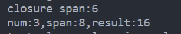

# **函数式编程**

***Rust***不像其他面向对象编程语言那样喜欢通过类来解决问题，而是推崇函数式编程。

## 什么是函数式编程

函数式编程是指将函数作为参数值或其他函数的返回值，在将函数赋值给变量之后执行。其中函数式编程的两个重要构件，分别是闭包和迭代器。

### **闭包**

闭包是一种可以保存变量或者作为参数传递给其他函数使用的匿名函数。闭包可以在一处创建，然后在不同的上下文中执行。与普通函数不同，闭包允许捕获调用者作用域中的值，闭包特别适合用来定义那些只使用一次的函数。

```rust
//伪代码
//定义普通函数
fn func_name(func_parameter) -> func_return_type{
    code_body;
    return_type
}

//定义闭包
|func_parameter| {
    code_body;
    return_value
}
```

注意：

闭包也可能没有参数，同时返回值也可写可不写。***Rust***会自动推断闭包的参数类型和返回值类型，所以参数和返回值类型都可以不写。为了使用闭包，只需要将其赋值给变量，然后像调用函数一样调用它即可。

```rust
   let count = |x:i32|->i32 {
        x+1
    };
    let num = 3;
    println!("{num},{}",count(num));
   /*
   *下面这种写法，入参类型和返回值类型都依赖上下文自动推断
   */
   // let count = |x|{
    //     x
    // };
    // let num = 3;
    // println!("{num},{}",count(num));
```

闭包同样可以使用外部变量

```rust
  let span = 6;
    let count = |x:i32|->i32 {
        x+span
    };
    let num = 3;
    println!("{num},{}",count(num));
```

闭包捕获外部变量存在三种可能的目标：

- 获取外部变量的所有权
- 获取普通引用
- 获取可变引用

于是***Rust***针对三种目标分别提供3个特征对象***Trait***

- ***FnOnce***：会消费从周围作用域捕获的变量，即闭包会并获取外部变量的所有权并在定义闭包时将其移仅闭包内，***Once***代表这种闭包只能被调用一次。
- ***FnMut***：会获取可变的借用值，因此可以改变外部变量。
- ***Fn***：获取不可变的借用值

相当于实现了所有权系统的所有权移动、可变引用和普通引用。理解一下诞生思路：

- 由于所有闭包都可以被调用一次，因此所有闭包都实现了***FnOne***特征
- 没有移动变量所有权到闭包内而只使用可变引用的闭包，实现了***FnMut***
- 不需要对其变量进行可变访问的闭包实现***Fn***

#### ***move***

如果希望强制将外部变量的所有权移动到闭包内，可以使用***move***关键字。

```rust
let mut span = 6;
    let num = 3;
    let count = move |x:i32| {
        //span 的所有权移动到闭包内了，但是从结果来看对于这种基础类型i32更多的是在闭包内复制了一个span不影响外部使用
        //这里仅仅是通过复制的效果，实现了移动span所有权，注意可变特性使用FnMut
        println!("closure span:{}",span);
        x+span
    };
    span += 2;
    let result = count(10);
    println!("num:{},span:{},result:{}",num,span,result);
```

测试结果



## **迭代器**

迭代器允许对一个序列进行某些处理，并且会遍历这个序列中的每一项以决定何时结束。迭代器默认都要实现**Iterator trait**。而**Iterator trait**有两个方法：

**iter()和next()**

```
iter()//返回一个迭代器
next()//返回迭代器中的下一项
```

迭代器通常有三种:

| 方法名          | 描述                                     |
| --------------- | ---------------------------------------- |
| **iter()**      | 返回只读可重入迭代器，元素类型为&T       |
| **iter_mut()**  | 返回可修改可重入迭代器，元素类型位&mut T |
| **into_iter()** | 返回只读不可重入迭代器，元素类型为T      |

**即：**

- 如果只读取值，实现iter()

- 如果还需要修改原始数据，实现iter_mut()

- 如果原始数据直接转换为迭代器，实现into_iter()，以获取原始数据所有权并返回一个迭代器

  实验如下：

```rust
fn iter_test(){
    let nums = vec![1,2,3,4,5,6,7,8];
    for num in nums.iter(){
        println!("num:{}",num+1);
    }
    println!("nums:{:?}",nums);
}
fn iter_mut_test(){
    let mut nums = vec![1,2,3,4,5,6,7,8];
    for num in nums.iter_mut(){
        *num = *num+2;
        println!("num:{}",num);
    }
    println!("nums:{:?}",nums);
}
fn into_iter_test(){
    let nums = vec![1,2,3,4,5,6,7,8];
    for num in nums.into_iter(){
        println!("num:{}",num);
    }
    // 等价于
    // for num in nums.into_iter(){
    //     println!("num:{}",num);
    // }
    // println!("nums:{:?}",nums); //borrow of moved value: `nums` ,value borrowed here after move
}
```

迭代器除了转移原始数据所有权之外，迭代器本身也可以被消费或再生成迭代器。

**消费（消费者）**：消费是迭代器上的一种特殊操作，目标是将迭代器转换成其他类型的值而非另一个迭代器。**sum、collect、nth、find、next、fold**都是消费者，它们会对迭代器执行操作得到最终值。

**适配（生产者）**：迭代器的生成者就是适配器，就是对迭代器进行遍历生成一个增强约束的迭代器，**注意，新迭代器一定是原始迭代器的子集**，其中，**take、skip、rev、filter、map、zip、enumerate**都是适配器。其实迭代器本身也是适配器。

```rust
  let nums = vec![1,2,3,4,5,6];
    let total = nums.iter().sum::<i32>();
    println!("total:{total}");

    //收集0..100的偶数
    let nums_even:Vec<i32> = (0..100).filter(|n| {0== n%2}).collect();//collect是适配器
    println!("{:?}",nums_even);

    //求小于1000的能被3整除或5整除的所有整数之和
    let sum:i32 = (0..1000).filter(|n|{0==n%3||0==n%5}).sum::<i32>();
    println!("{}",sum);
```

