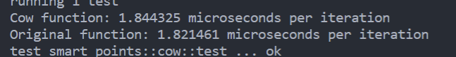

# **智能指针**

## 概念

- 指针是包含内存地址的变量，用于引用或只想其他的数据。

- ***Rust***中最常见的指针是引用，而引用只是一种普通指针，除了引用数据之外，没有其他功能，

- 智能指针则是一种数据结构，其行为类似于指针，含有元数据，且在大部分情况下拥有指向的数据，提供内存管理或者绑定检查等附加功能，如管理文件句柄和网络连接。例如***Rust***中的***Vec、String***都可以看作智能指针。

  ***Rust***语言为智能指针封装了两大***Trait***，当变量实现了这两个***Trait***后就不再是普通变量：

  - ***Deref***

    实现了***Deref***后，变量重载了解引用运算符*****,可以当作普通引用来使用，必要时可以自动或手动实现解引用。

  - ***Drop***

    实现***Drop***后，变量在超出作用域时会自动从堆中释放，当然还可以自定义实现其他功能，如释放文件或网络连接。

## 特征

- 智能指针在大部分情况下具有其所指向数据的所有权
- 智能指针是一种数据结构，一般使用结构体来实现
- 智能指针实现了Deref和Drop两个大trait

| 名称             | 描述                                   | 实际作用                                                     |
| ---------------- | -------------------------------------- | ------------------------------------------------------------ |
| ***Box&lt;T&gt;***   | 一种独占所有权的智能指针               | 指向存储在堆上且类型为T的数据                                |
| ***Rc&lt;T&gt;***      | 一种共享所有权的计数智能指针           | 用于记录存储在堆上的值的引用数                               |
| ***Arc&lt;T&gt;***     | 一种线程安全的共享所有权的计数智能指针 | 可用于多线程                                                 |
| ***Cell&lt;T&gt;***    | 一种提供内部可变性的容器，不是智能指针 | 允许借用可变数据，编译时检查，参数T要求实现***Copy trait***  |
| ***RefCell&lt;T&gt;*** | 一种提供内部可变性的容器，不是智能指针 | 允许借用可变数据，运行时检查，参数T不要求实现***Copy trait*** |
| ***Weak&lt;T&gt;***    | 一种与***Rc&lt;T&gt;***对应的弱引用类型      | 用于解决***RefCell&lt;T&gt;***中出现的循环引用。                   |
| ***Cow&lt;T&gt;***     | 是一种写时复制的枚举体智能指针         | 我们使用***Cow&lt;T&gt;***主要是为了减少内存分配和复制，***Cow&lt;T&gt;***适用于读多写少的场景。 |
| ***Pin&lt;T&gt;*** | Rust 标准库中的另一种智能指针类型 | 用于解决在异步编程和使用不稳定的 ***APIs*** 时，对象被移动的问题。***Pin*** 可以用于固定***（pin）***一个对象的内存地址，确保它不会被移动。 |

## 自定义智能指针

1. 定义一个结构体MYBOX

   ```rust
   use std::ops::Deref;
   //定义一个泛型参数的元组结构体
   struct MYBOX<T>(T);
   //为元组结构体实现一个创建实例的方法
   impl<T> MYBOX<T>  {
       fn new(x:T) -> Self{
           Self(x)
       }
   }
   ```

2. 结构体实现***Deref***特征

   ```rust
   impl<T> Deref for MYBOX<T> {
       type Target = T;
       fn deref(&self) -> &Self::Target {
           &self.0
       }
   }
   ```

3. 测试解引用

   ```rust
   #[test]
   fn test(){
       let x = MYBOX::new(21);
       println!("{:?}",*x);
   }
   ```

4. 结构体实现***Drop***特征

   ```rust
   impl <T> Drop for MYBOX<T> {
       fn drop(&mut self) {
           println!("ALREADY DROP")
       }
   }
   ```

## **引用计数智能指针**

**所有权系统规则规定了一个值在任意时刻只能有一个所有者，但在有些场景下，我们又需要让值具有多个所有者**

故为了应对这种情况，所以***Rust***提供了***Rc***智能指针，***Rc***是一种可共享的引用计数智能指针，能产生多所有权值。
***引用计数意味着通过记录值得引用数来判断值是否仍在使用，如果引用数时0，就表示值可以被清理***

所有权共享可以理解成教室里的灯，最后离开教室的人负责关灯，同理，在***Rc***的各个使用者中，只有最后一个使用者会清理数据。克隆***Rc***会增加引用计数，就像教师里新来了一个人一样。

```rust
// 创建一个 Rc 实例 one，包装整数值 1
let one = Rc::new(1); 
// 克隆 Rc 实例 one，创建另一个指向同一资源的 Rc 实例 another_one
let another_one = one.clone(); 
// 打印引用计数的值
println!("count: {}", Rc::strong_count(&another_one)); 
//count: 2
```

***注意：Rc可以共享所有权但进限制于单进程环境，为了解决多进程情况下所有权机制共享问题于是诞生了Arc（原子引用计数）***

## **原子引用计数智能指针**

***Arc（原子引用计数智能指针）***实际上是***Rust***提供的线程安全的***Rc***版本

***Arc特点：***

- ***Arc***在堆上分配了一个共享所有权的***T***类型
- 在***Arc***上调用clone函数会产生一个新的***Arc***，它指向与原***Arc***相同的堆，同时增加引用计数。
- ***Arc***默认是不可变的，要想在多个线程间修改***Arc***，就需要配合锁机制，如***Mutex***。

***注意：Rc和Arc默认不能改变内部值，但有时修改内部值又是必需的，为了解决此问题 Rust提供了两个具有内部可变性的容器Cell和RefCell。内部可变性是Rust中的一个设计模式，允许在拥有不可变引用时修改数据，但通常这是不被借用规则允许的，为此该模式必须通过UnSafe Rust实现，在unsafe块内执行***

## ***Cell&lt;T&gt;和RefCell&lt;T&gt;***

***Cell的方法特点：***

- 对于实现了***Copy特性***的内部值类型，*get*方法可以直接查看内部值
- 对于实现了***Default***特性的数据类型，*take*方法会用默认值替换内部值
- 对于所有数据类型，*replace*方法会替换并返回被替换的值
- ***into_inner***方法则消费***Cell***并返回内部值

```rust
let a = Cell::new(2);
	println!("get:{}",a.get());
    a.set(6);
    println!("get:{}",a.get());
    println!("take out:{}",a.take());
    println!("take in:{}",a.get());
    println!("replace out:{}",a.replace(5));
    println!("replace in:{}",a.get());
    //into_inner()会把a move掉
    println!("into_inner:{}",a.into_inner());
```

***Cell***相当于在不可变结构体*Fields*上开了一个后门，从而能够改变内部的某些字段。

```rust
use std::cell::Cell;
use std::ops::Deref;
struct Grid {
    width:i32,
    height:Cell<i32>
}
impl Grid {
    fn new(&self,w:i32,h:i32) -> Self{
        Self{
            width:w,
            height:Cell::new(h)
        }
    }

}
impl Deref for Grid {
    type Target = (i32,i32);
    fn deref(&self) -> &Self::Target {
    // &(self.width, self.height)  cannot return reference to temporary value returns a reference to data owned by the current function
        Box::leak(Box::new((self.width, self.height.get())))
    }
}
#[test]
fn test(){
    
    let grid =  Grid{
        width:100,
        height:Cell::new(200)
    };
    grid.height.set(600);
    println!("{:?}",*grid);
}
```

***中间遇到了为Grid实现解引用的问题：cannot return reference to temporary value returns a reference to data owned by the current function***

由于 ***Deref trait*** 的要求，我们不能返回对临时值的引用，而在 ***deref*** 方法中返回的是对临时元组*** (self.width, self.height)*** 的引用，这导致了错误。

如果希望在解引用 ***defGrid*** 时打印出元组，一种可行的方法是创建一个新的元组并将其返回，而不是返回对临时值的引用。

我们在deref方法中使用 ***Box::new((self.width, self.height))*** 创建一个新的元组，并使用 ***Box::leak*** 来将其转换为静态引用。这样，我们可以返回对元组的引用，而不是对临时值的引用。

请注意，使用 ***Box::leak*** 来转换为静态引用时需要小心，因为它会泄漏内存。在这个例子中，由于元组是一个非常简单的数据结构，我们可以安全地使用 ***Box::leak***。

***RefCell&lt;T&gt;***

***RefCell***与***Cell***的区别和***Ref***有关。***RefCell***不是用*get*和*set*方法，而是直接通过获取可变引用来修改内部数据。

实验过程中遇到了获取不可变引用和可变引用的无法同时使用的问题

```rust
  let rc = RefCell::new(4);
    // 使用 borrow 方法获取不可变引用，注意先获取不可变引用，由于借用规则，不可再通过rc获取可变引用
    let rc_data = rc.borrow();
    println!("first try: {}", *rc_data);

    // 在内部作用域中获取可变引用,想法是做隔离，然而事实上rc仍处于被借用状态
    {
        let mut mutable_data = rc.borrow_mut();
        *mutable_data += 10;
        println!("The updated value is: {}", *mutable_data);
    } 

```

```
thread 'smart_points::ref_cell::test' panicked at 'already borrowed: BorrowMutError'
```

要想代码运行成功，事实证明应该包在内部作用域的是获取不可变引用的逻辑

```rust
 let rc = RefCell::new(4);
    // 使用 borrow 方法获取不可变引用，注意先获取不可变引用，由于借用规则，不可再通过rc获取可变引用
    {
        let rc_data = rc.borrow();
        println!("first try: {}", *rc_data);
    }
    // 在内部作用域中获取可变引用
    let mut mutable_data = rc.borrow_mut();
    *mutable_data += 10;
    println!("The updated value is: {}", *mutable_data);
```

```
running 1 test
first try: 4
The updated value is: 14
test smart_points::ref_cell::test ... ok
```

然而下一步实验证明若是同一个作用域内，先执行获取可变引用再执行不可变引用同样会引起借用恐慌。

```rust
    let rc = RefCell::new(4);
    {
        let rc_data = rc.borrow();
        println!("first try: {}", *rc_data);
    }
    // 在内部作用域中获取可变引用
    let mut mutable_data = rc.borrow_mut();
    *mutable_data += 10;
    println!("The updated value is: {}", *mutable_data);
    
    let rc_data_one = rc.borrow();
    println!("final try: {}", *rc_data_one);
```

```
first try: 4
The updated value is: 14
thread 'smart_points::ref_cell::test' panicked at 'already mutably borrowed: BorrowError'
```

修正后
```rust
	let rc = RefCell::new(4);
    // 在内部作用域中获取不可变引用
    {
        let rc_data = rc.borrow();
        println!("first try: {}", *rc_data);
    }
    // 在内部作用域中获取可变引用
    {
    let mut mutable_data = rc.borrow_mut();
    *mutable_data += 10;
    println!("The updated value is: {}", *mutable_data);
    }
    
    let rc_data_one = rc.borrow();
    println!("final try: {}", *rc_data_one);
```

```
first try: 4
The updated value is: 14
final try: 14
test smart_points::ref_cell::test ... ok
```

***Cell和RefCell的区别：***

- ***Cell***直接通过替换值来进行修改，***RefCell***则通过可变引用来进行修改。
- ***Cell***需要替换和移动值，故***Cell***适合实现了***Copy***的数据类型。
- ***RefCell***并不移动数据，所以***RefCell***适合未实现***Copy***的数据类型。
- 另外，***Cell***在编译时做检查，***RefCell***在运行时做检查，使用不当会产生***Panic***异常。

***Rust***本身提供了内存安全的保证，这意味着很难发生内存泄漏，然而***RefCell***有可能会造成循环引用，进而导致内存泄漏。

***故为了解决循环引用问题，Rust提供了Weak智能指针***

通过与***Rc***对比加强对***Weak***智能指针的理解：

- ***Rc***每次克隆时都会增加实例的强引用计数*strong_count*的值，只有*strong_count*的值为0值，只有*strong_count*为0时实例才会被清理。循环引用中的*strong_count*的值永远不会为0。
- ***Weak***智能指针不增加*strong_count*的值，而是增加*weak_count*的值。*weak_count*无须为0就能清理数据。以此解决循环引用的问题。

***Weak*** 是 ***Rust*** 标准库中的智能指针类型之一，用于解决循环引用***（Circular reference）***问题。循环引用指的是两个或多个对象之间形成了一个环状的引用关系，***即 A 引用了 B，B 又引用了 A***。如果使用普通的 ***Rc***（引用计数智能指针）来管理对象之间的引用关系，循环引用会导致内存泄漏，因为对象的引用计数永远不会变为零。

***Weak***的特点是：它允许你创建一个弱引用，而不会增加引用计数。这意味着当你使用***Weak***来建立对象之间的引用关系时，对象之间的循环引用不会导致内存泄漏。当***Rc*** 中的所有强引用都离开作用域时，对象会被正确释放，而不会因为循环引用而造成资源泄漏。

***Weak*** 的生命周期是独立于引用计数的，它不会影响对象的引用计数。因此，你需要小心处理 ***Weak***引用，因为当你尝试通过 ***Weak***获取对象的强引用时，对象可能已经被释放，此时获取的值是 ***None***。

***Weak*** 智能指针的主要方法有：

1. ***upgrade***: 用于尝试将弱引用升级为强引用。它返回 ***Option<Rc&lt;T&gt;>***，如果对象还未被释放，会返回 ***Some(Rc&lt;T&gt;)***，否则返回 ***None***。
2. ***ptr_eq***: 检查两个***Weak*** 引用是否指向相同的对象。
3. ***strong_count***: 获取***Weak***  引用关联的***Rc*** 引用的数量，即共享指针的引用计数。
4. ***weak_count***: 获取 ***Weak***  引用关联的***Rc*** 引用的弱引用计数。
5. ***downgrade*** 方法接收一个 ***Rc*** 智能指针作为参数，并返回一个与之关联的 ***Weak***引用。***Rc::downgrade*** 方法不会增加引用计数，因为它创建的是一个弱引用，弱引用不会增加引用计数，也不会阻止对象的释放。这样，当所有***Rc*** 引用离开作用域时，对象的引用计数可能会变为零，并在接下来的垃圾回收过程中被释放

在实际使用中，***Weak***  智能指针通常与 ***Rc***智能指针配合使用，用来构建可循环引用的数据结构，并防止内存泄漏。

```rust
use std::borrow::BorrowMut;
use std::cell::RefCell;
use std::rc::{Rc,Weak};
struct Car{
    name:String,
    wheels:RefCell<Vec<Weak<Wheel>>>
}
struct Wheel{
    id:i32,
    car:Rc<Car>
}
#[test]
fn test(){
    let car:Rc<Car> = Rc::new(
        Car {
            name: "Changcheng".to_string(),
            wheels:RefCell::new(vec![])
        }
    );
    let wheel_one:Rc<Wheel>= Rc::new(Wheel{id:1,car:Rc::clone(&car)});
    let wheel_two:Rc<Wheel> = Rc::new(Wheel { id: (2), car: (Rc::clone(&car)) }); 
    //可变借用赋值放在内部代码块中可避免与后续的不可变借用产生冲突
    { 
    let mut wheels = car.wheels.borrow_mut();
    wheels.push(Rc::downgrade(&wheel_one));
    wheels.push(Rc::downgrade(&wheel_two));
    }
    // println!("{}",car.name);
    //不可变借用car.wheels.borrow()
    for wheel_weak in car.wheels.borrow().iter() {
    // for wheel_weak in wheels.iter() {
        let wl = wheel_weak.upgrade().unwrap();
        println!("车轮id{},车名name{}",wl.id,wl.car.name);
    }
    println!("{}",Rc::downgrade(&wheel_one).weak_count());
}
/**
*我们通过 Rc::downgrade 创建了弱引用，并使用 upgrade 方法尝试将弱引*用升级为强引用。这样就避免了循环引用导致的内存泄漏。
*/
```

## ***Cow***(***copy on write***)写时的复制指针

***Cow***不是严格意义上的智能指针，而是一个封装好的枚举类型、

```rust
pub enum Cow<'a,B> where B: a'+ ToOwned +'a + ?Sized{
    Borrowed(&'a B), //包裹引用
    Owned(<B as ToOwned>::Owned) //包裹所有者
}
```

- Borrowed的含义是以不可变的方式访问借用内容
- Owned的含义是需要可变借用或所有权时克隆一份数据。

```rust
//写一个过滤字符串空格的函数
fn filter_space(src: &str) -> String {
    //使用with_capacity函数预置一个src长度大小内存空间，空间具有伸展性，随着字符串的溢出而伸展
    let mut target = String::with_capacity(src.len());
    for c in src.chars() {
        if ' ' != c {
            target.push(c);
        }
    }
    target
}

//使用枚举智能指针cow
fn filter_space_cow<'a>(src: &'a str) -> Cow<'a, str> {
    let mut target = String::with_capacity(src.len());
    if src.contains(' ') {
        for c in src.chars() {
            if ' ' != c {
                target.push(c);
            }
        }
        return Cow::Owned(target);
    }
    Cow::Borrowed(src)
}
```

现阶段循环调用测试一下两个函数花费的时间，根据目前接触书本理论的结果，使用***Cow***的优越性比较高，后续会借助专业的库和工具，从内存消耗和执行时间两个层面去比较。

```rust
fn compare() {
   
    let input = "Hello, Rust! This is a test string with spaces.";
    let iterations = 1000000;
  

    // 使用 Cow 智能指针函数性能测试
    let start = Instant::now();
    for _ in 0..iterations {
        filter_space_cow(input);
    }
    let duration = start.elapsed();
    println!(
        "Cow function: {} microseconds per iteration",
        duration.as_micros() as f64 / iterations as f64
    );

     // 原始函数性能测试
    let start = Instant::now();
    for _ in 0..iterations {
        filter_space(input);
    }
    let duration = start.elapsed();
    println!(
        "Original function: {} microseconds per iteration",
        duration.as_micros() as f64 / iterations as f64
    );
}
```

测试结果如下：似乎没有太大的区别，甚至Cow消耗平均时间要多一些。但由于个人的测试函数比较草率，测试结果仅供参考。



## ***Pin&lt;T&gt;***

是 ***Rust*** 标准库中的另一种智能指针类型，它用于解决在异步编程和使用不稳定的*** APIs*** 时，对象被移动（***Drop***）的问题。它在内存管理方面与其他智能指针类型有所不同

当我们使用 ***async/await*** 和 ***Future*** 来进行异步编程时，经常需要将 ***Future*** 固定在内存中，以确保它在异步执行时不会被移动。这就是 ***Pin*** 指针的典型应用场景。

TODO等待后续学习完异步的内容进行实验补充
