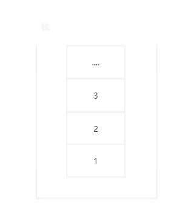
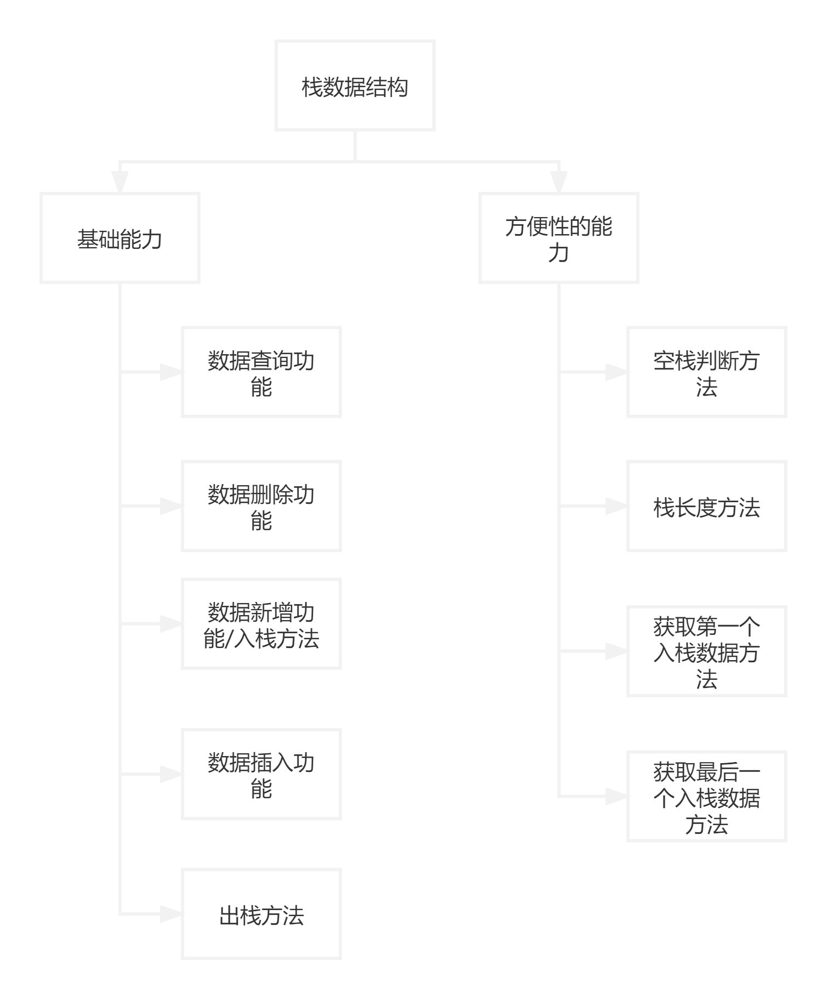
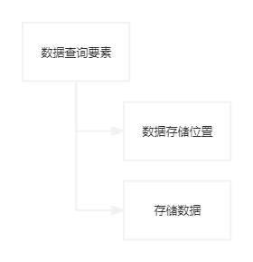
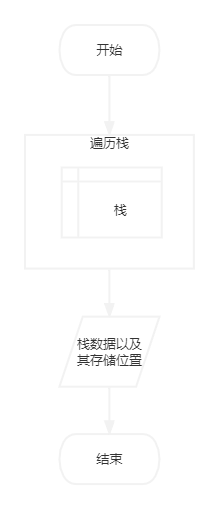
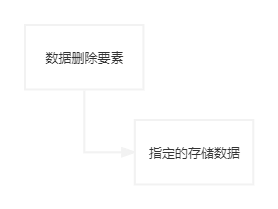
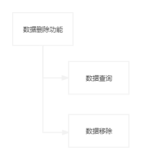
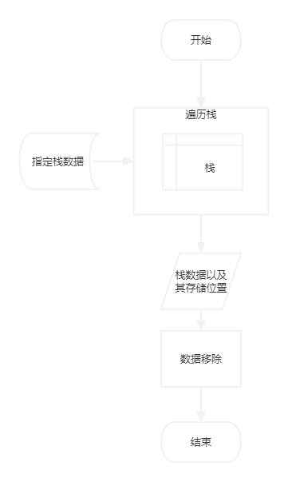
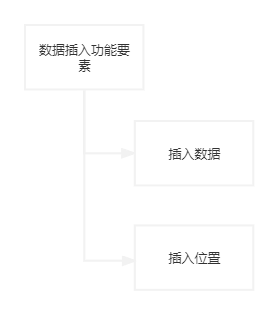
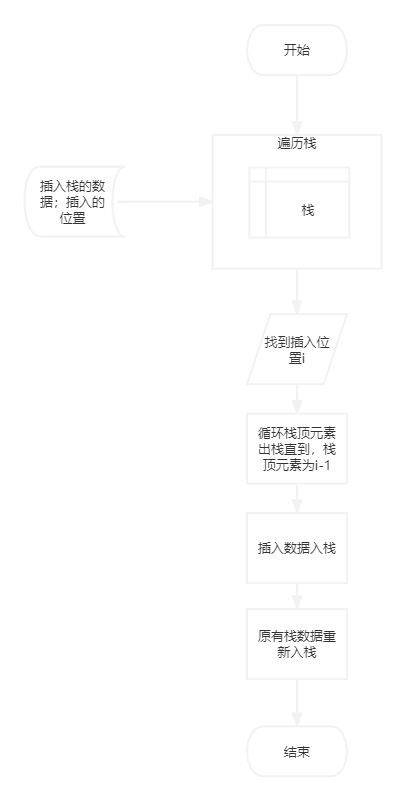
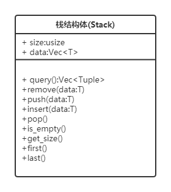

# ***Rust*实现栈数据结构**

## 数据结构(*stack*)的概念

栈就是一种线性数据结构，可用于函数调用、网页数据记录等。

**栈的特性：元素先进后出，后进先出**

## 需求来源：

了解栈数据结构和结构特性。

## 目标：

- 语言：**Rust**

- 实现一个数据存储结构栈：`Stack`

  栈具有存储数据先进后出、后进先出的特性。

## 功能需求：

- 开辟一个栈结构的存储空间
- 存储数据的基本操作：
  1. 数据查询
  2. 数据添加
  3. 数据删除
  4. 数据插入

- 方便性工具方法
  1. 空栈判断方法
  2. 栈长度方法
  3. 快速返回第一个入栈数据
  4. 快速返回最后一个出栈数据

## 总体功能结构图

## 基础能力

### 数据查询功能

查询栈中的所有元素及其数据存储位置

- 数据查询要素

- 数据查询功能结构图

  无
  
- 数据查询功能流程图

  

### 数据删除功能

删除指定的存储数据

- 数据删除要素

  

- 数据删除功能结构图

  

- 数据删除功能流程图

  

### 数据新增功能/数据入栈

数据新增实际为入栈方法，即添加到栈顶

- 数据新增要素

  待入栈的数据

- 数据新增功能结构图

  无

- 数据新增功能流程图

  无

### 数据插入功能

数据插入根据指定位置插入栈中

- 数据插入要素

  

- 数据插入功能结构图

  无

- 数据插入功能流程图

  

### 出栈方法

移除栈顶元素

- 出栈要素

  栈顶位置top

- 出栈功能结构图

  无

- 出栈功能流程图

- 无

## 方便性能力

### 空栈判断方法

- 空栈判断要素
- 空栈判断方法功能流程图

### 栈长度方法

- 栈长度方法

### 获取第一个入栈数据方法

- 返回栈底元素

### 获取最后一个入栈数据方法

- 返回栈顶元素

## 程序结构图

## 程序处理流程图

TODO

- `query`查询方法
- `remove`删除方法
- `push`入栈方法
- `insert`插入方法
- `pop`出栈方法
- `is_empty`空栈判断方法
- `get_size`获取栈大小的方法
- `first`返回栈底数据
- `last`返回栈顶数据

## 程序实现

TODO
