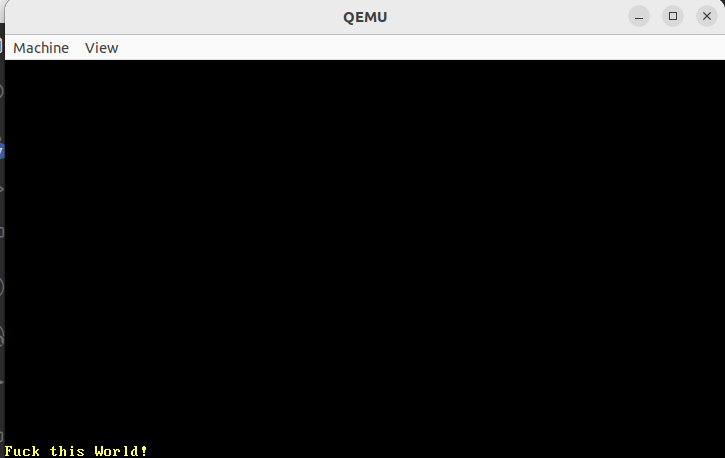

# VGA文本模式

[参考原作者phil的官方博客](https://os.phil-opp.com/vga-text-mode/#the-vga-text-buffer)

目标：**VGA**文本模式将字符打印到屏幕上，要实现此目标需要将字符写入到VGA硬件的文本缓冲区。VGA文本缓冲区是一个二维数组，通常有25行和80列，直接呈现到屏幕上。每个数组条目通过以下格式描述单个屏幕字符：

| 位    | 值      |
| ----- | ------- |
| 0-7   | ASCII码 |
| 8-11  | 前景色  |
| 12-14 | 背景色  |
| 15    | 闪烁位  |

第一个字节表示应以 [ASCII 编码](https://en.wikipedia.org/wiki/ASCII)打印的字符。更具体地说，它并不完全是 ASCII，而是一个名为代码[*页 437*](https://en.wikipedia.org/wiki/Code_page_437) 的字符集，其中包含一些附加字符和轻微修改。为简单起见，我们将在这篇文章中继续称其为 ASCII 字符。第二个字节定义字符的显示方式。前四位定义前景色，后三位定义背景色，最后一位定义字符是否应该闪烁。

| 数值位 | 颜色       | 数值位+明亮位 | 亮色        |
| ------ | ---------- | ------------- | ----------- |
| 0x0    | Black      | 0x8           | Dark Gray   |
| 0x1    | Blue       | 0x9           | Light Blue  |
| 0x2    | Green      | 0xa           | Light Green |
| 0x3    | Cyan       | 0xb           | Light Cyan  |
| 0x4    | Red        | 0xc           | Light Red   |
| 0x5    | Magenta    | 0xd           | Pink        |
| 0x6    | Brown      | 0xe           | Yellow      |
| 0x7    | Light Gray | 0xf           | White       |

明亮位是高4位，对于前景色是色调变亮；对于背景色则是用作闪烁位

VGA 文本缓冲区可通过[内存映射的 I/O](https://en.wikipedia.org/wiki/Memory-mapped_I/O) 访问地址。这意味着对该地址的读取和写入不会访问 RAM，而是直接访问 VGA 硬件上的文本缓冲区。这意味着我们可以通过正常的内存操作读取和写入该地址`0xb8000`

请注意，内存映射硬件可能不支持所有正常的 RAM 操作。例如，设备只能支持按字节读取，并在读取 a 时返回垃圾。幸运的是，文本缓冲区[支持正常的读取和写入](https://web.stanford.edu/class/cs140/projects/pintos/specs/freevga/vga/vgamem.htm#manip)，因此我们不必以特殊方式处理它`u64`

## Rust 模块

该模块用来处理字符打印逻辑

```
// in src/main.rs
mod vga_buffer;
```

打印逻辑主要分为以下几步：

1. 定义颜色
2. 定义屏幕字符和文本缓冲区
3. 实现打印方法

### 定义颜色

1. 枚举颜色

   ```rust
   #[allow(dead_code)]
   #[derive(Debug, Clone, Copy, PartialEq, Eq)]
   #[repr(u8)]
   pub enum Color {
       Black = 0, //00000000
       Blue = 1, //00000001
       Green = 2, //00000010
       Cyan = 3, //00000011
       Red = 4,  //00000100
       Magenta = 5, //00000101
       Brown = 6, //00000110
       LightGray = 7, //00000111
       DarkGray = 8, //00001000
       LightBlue = 9, //00001001
       LightGreen = 10, //00001010
       LightCyan = 11, //00001011
       LightRed = 12, //00001100
       Pink = 13, //00001101
       Yellow = 14, //00001110
       White = 15, //00001111
   }
   ```

   - `#[allow(dead_code)]`用来禁用未使用枚举元素的警告

   - `#[repr(u8)]` 是 Rust 中的一个属性（attribute），用于指定枚举或结构体的内部表示方式。在这个例子中，`#[repr(u8)]` 指示编译器使用 8 位无符号整数来表示枚举或结构体的成员。

   **注意：`repr` 是 "representation" 的缩写，用于控制数据在内存中的布局。在这里，`u8` 表示无符号 8 位整数，也就是一个字节的大小；这里之所以使u8的原因是因为Rust年没有u4类型**

   这里每个颜色将表示成一个8位无符号整数。每个变体分配一个不同的整数值，确定好他们在内存中的布局。使用`#[repr(u8)]`可以对内存布局进行更精确的控制

   - `#[derive(Debug, Clone, Copy, PartialEq, Eq)]`实现这些特征的目的为了方便打印、赋值、借用和比较

2. 创建颜色结构体

   ```rust
   // in src/vga_buffer.rs
   
   #[derive(Debug, Clone, Copy, PartialEq, Eq)]
   #[repr(transparent)]
   struct ColorCode(u8);
   
   impl ColorCode {
       fn new(foreground: Color, background: Color) -> ColorCode {
           ColorCode((background as u8) << 4 | (foreground as u8))
       }
   }
   ```

   `#[repr(transparent)]`是 Rust 中的一个属性（attribute），用于表示一个结构体（或枚举）在内存中的布局与其单个字段的布局完全相同。这个属性告诉编译器不要对该类型进行额外的优化，保持与其包含的单个字段的内存表示方式一致。

   这里的目标就是保证`ColorCode`的内存布局与`u8`保持一致，`ColorCode((background as u8) << 4 | (foreground as u8))`左移4位因为文本模式表示颜色时，高位表示背景色，低位表示前景色。

### 文本缓冲区

添加结构体表示屏幕字符和文本缓冲区

- 通过`ascii_character`ASCII码字符位、`color_code`颜色编码描述屏幕字符。
- 文本缓冲区直接用一个包装类型Buffer描述，这里的 `Buffer` 结构体包含一个名为 `chars` 的字段，该字段是一个二维数组，每个元素是一个 `ScreenChar` 结构体。通过使用 `#[repr(transparent)]`，你告诉编译器，在内存中，`Buffer` 的布局应该与 `chars` 的布局相同。这意味着 `Buffer` 结构体在内存中的起始地址就是 `chars` 的起始地址，没有额外的包装或填充。这通常用于包装类型，以确保对包装类型的访问不会引入额外的开销。在这个例子中，`Buffer` 可能是一个对二维字符数组的包装，而 `#[repr(transparent)]` 确保了对 `Buffer` 实例的访问与对 `chars` 实例的访问相同。

```rust
// in src/vga_buffer.rs

#[derive(Debug, Clone, Copy, PartialEq, Eq)]
#[repr(C)]
struct ScreenChar {
    ascii_character: u8,
    color_code: ColorCode,
}

const BUFFER_HEIGHT: usize = 25;
const BUFFER_WIDTH: usize = 80;

#[repr(transparent)]
struct Buffer {
    chars: [[ScreenChar; BUFFER_WIDTH]; BUFFER_HEIGHT],
}
```

`chars: [[ScreenChar; BUFFER_WIDTH]; BUFFER_HEIGHT]` 是一个字段声明，它表示一个二维数组，用于存储 `ScreenChar` 结构体的元素。让我们分解一下这个声明：

- `ScreenChar` 是一个结构体类型，可能包含了表示屏幕上单个字符的相关信息，比如字符本身、颜色、样式等。
- `BUFFER_WIDTH` 和 `BUFFER_HEIGHT` 是常量或者编译时常量，用来指定二维数组的宽度和高度。这两个常量决定了 `chars` 字段的大小，也即是 `Buffer` 结构体的大小。

因此，`chars` 字段是一个二维数组，其中每个元素都是 `ScreenChar` 类型。这种结构通常用于表示屏幕缓冲区，其中 `BUFFER_WIDTH` 表示一行上的字符数，`BUFFER_HEIGHT` 表示屏幕上的行数。

`#[repr(C)]` 是 Rust 中的一个属性（attribute），用于指示结构体或枚举在内存中的布局应该按照 C 语言的规则进行。这个属性主要用于与 C 语言进行交互、与 C ABI（Application Binary Interface）兼容，以及确保 Rust 类型在内存中的布局与 C 类型兼容。

C 语言有一些规则来定义结构体和枚举在内存中的布局，包括字段的排列顺序和对齐方式。使用 `#[repr(C)]` 属性，Rust 可以尽量按照这些规则来组织内存布局，以便在与 C 语言编写的代码进行交互时，数据的传递和访问是可预测的。

为了实际写入屏幕，我们现在创建一个写入器类型：

写入器包含三个要素：写入的位置、字符颜色和文本缓冲区

```rust
// in src/vga_buffer.rs
pub struct Writer {
    column_position: usize,
    color_code: ColorCode,
    buffer: &'static mut Buffer,
}
```

### 打印

如果我们希望使用写入器区改变文本缓冲区的字符数据，需要实现一个单字节ASCII码的写入方法，

这里的打印策略包含以下几种：

1. `\n`换行符进入下一行
2. 其他字节
   - 当字节位置大于单行最大字符数时，进入下一行
   - 其他情况，将字节写入写入器的文本缓冲区buffer

下面采用模式匹配完成单字节打印函数

```rust
impl Writer {
    pub fn write_byte(&mut self, byte: u8) {
        match byte {
            b'\n' => self.new_line(),
            byte => {
                if self.column_position >= BUFFER_WIDTH {
                    self.new_line();
                }

                let row = BUFFER_HEIGHT - 1;
                let col = self.column_position;

                let color_code = self.color_code;
                self.buffer.chars[row][col] = ScreenChar {
                    ascii_character: byte,
                    color_code,
                };
                self.column_position += 1;
            }
        }
    }

    fn new_line(&mut self) {/* TODO */}
}
```

为了打印整个字符串，我们可以将其转换成字节序列然后一个个字符打印：

```rust
// in src/vga_buffer.rs

impl Writer {
    pub fn write_string(&mut self, s: &str) {
        for byte in s.bytes() {
            match byte {
                // printable ASCII byte or newline
                0x20..=0x7e | b'\n' => self.write_byte(byte),
                // not part of printable ASCII range
                _ => self.write_byte(0xfe),
            }

        }
    }
}
```

**注意ASCII 字符范围：** ASCII 字符是一个7位字符集，其中包含了一些控制字符（0x00到0x1F）和一些可打印字符（0x20到0x7E）。这个范围 `0x20..=0x7E` 正好覆盖了可打印的 ASCII 字符，包括空格（0x20）到波浪号（0x7E）之间的所有字符。 通过使用 `0x20..=0x7e`，代码有效地过滤了输入字符串中的非可打印 ASCII 字符，只允许这个范围内的字符通过。其他字符将被替换为一个特殊的不可打印字符（0xfe）。

### 测试一下打印功能

```rust
// in src/vga_buffer.rs

pub fn print_something() {
    let mut writer = Writer {
        column_position: 0,
        color_code: ColorCode::new(Color::Yellow, Color::Black),
        buffer: unsafe { &mut *(0xb8000 as *mut Buffer) },
    };

    writer.write_byte(b'F');
    writer.write_string("this");
    writer.write_string("World!");
}
```

**`buffer: unsafe { &mut \*(0xb8000 as \*mut Buffer) }`：** 这个字段是一个指向屏幕缓冲区的可变引用。`0xb8000` 是标准文本模式下的显存起始地址。通过将其转换为 `*mut Buffer` 类型，然后用 `&mut` 取引用，代码创建了一个指向屏幕缓冲区的可变引用。实际上`Buffer`的内存布局同字段`chars`是一个二维数组，这里使用了 `unsafe` 关键字，因为涉及到对原始指针的操作，这可能会导致不安全的行为。

调用`print_something`

```rust
// in src/main.rs

#[no_mangle]
pub extern "C" fn _start() -> ! {
    vga_buffer::print_something();

    loop {}
}
```

