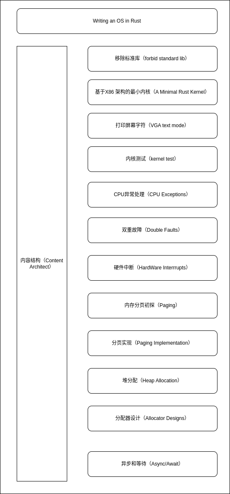

# **Blob Os** 内容大纲

- 移除**Rust**标准库

标准库需要底层操作系统的支撑，想要裸机运行代码，要求Rust可执行文件使用核心库而不是标准库。

- 基于**X86**架构的最小内核

基于**X86**架构和Rust语言编写最小化的64位内核。本章将构建一个向显示器打印字符串，并能被打包为一个能够引导启动的磁盘映像。

- **VGA**字符模式

**VGA 字符模式**（[VGA text mode](https://en.wikipedia.org/wiki/VGA-compatible_text_mode)）是打印字符到屏幕的一种简单方式。在这篇文章中，为了包装这个模式为一个安全而简单的接口，我们将包装 unsafe 代码到独立的模块。我们还将实现对 Rust 语言**格式化宏**（[formatting macros](https://doc.rust-lang.org/std/fmt/#related-macros)）的支持。

- 内核测试

本文主要讲述了在`no_std`环境下进行单元测试和集成测试的方法。我们将通过Rust的自定义测试框架来在我们的内核中执行一些测试函数。为了将结果反馈到QEMU上，我们需要使用QEMU的一些其他的功能以及`bootimage`工具。

- **CPU**异常处理

CPU异常在很多情况下都有可能发生，比如访问无效的内存地址，或者在除法运算里除以0。为了处理这些错误，我们需要设置一个 *中断描述符表* 来提供异常处理函数。在文章的最后，我们的内核将能够捕获 [断点异常](https://wiki.osdev.org/Exceptions#Breakpoint) 并在处理后恢复正常执行。

-  双重故障

在这篇文章中，我们会探索 double fault 异常的细节，它的触发条件是调用错误处理函数失败。通过捕获该异常，我们可以阻止致命的 *triple faults* 异常导致系统重启。为了尽可能避免 triple faults ，我们会在一个独立的内核栈配置 *中断栈表* 来捕捉 double faults。

- 硬件中断

在本文中，我们会对可编程的中断控制器进行设置，以将硬件中断转发给CPU，而要处理这些中断，只需要像处理异常一样在中断描述符表中加入一个新条目即可，在这里我们会以获取周期计时器的中断和获取键盘输入为例进行讲解。

- 内存分页初探

本文主要讲解 *内存分页* 机制，一种我们将会应用到操作系统里的十分常见的内存模型。同时，也会展开说明为何需要进行内存隔离、*分段机制* 是如何运作的、*虚拟内存* 是什么，以及内存分页是如何解决内存碎片问题的，同时也会对x86_64的多级页表布局进行探索。

- 分页实现

这篇文章展示了如何在我们的内核中实现分页支持。它首先探讨了使物理页表帧能够被内核访问的不同技术，并讨论了它们各自的优点和缺点。然后，它实现了一个地址转换功能和一个创建新映射的功能。

- 栈分配

这篇文章为我们的内核增加了对堆分配的支持。首先，它介绍了动态内存，并展示了借用检查器如何防止常见的分配错误。然后，它实现了 Rust 的基本分配接口，创建了一个堆内存区域，并设置了一个分配器包。在这篇文章的最后，内置 `alloc` crate 的所有分配和收集类型都将可供我们的内核使用。

- 分配器设计

这篇文章解释了如何从头开始实现堆分配器。它介绍并讨论了不同的分配器设计，包括凸块分配、链表分配和固定大小块分配。对于这三种设计中的每一种，我们将创建一个可用于内核的基本实现。

- 异步和等待

在这篇文章中，我们将探讨 Rust 的*协作多任务处理*和 *async/await* 特性。我们详细介绍了 async/await 在 Rust 中是如何工作的，包括 `Future` 特性的设计、状态机转换和*固定*。然后，我们通过创建一个异步键盘任务和一个基本的执行器，将对 async/await 的基本支持添加到我们的内核中。
