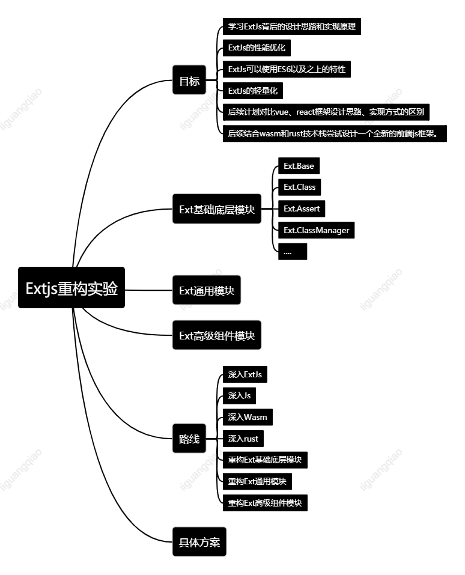
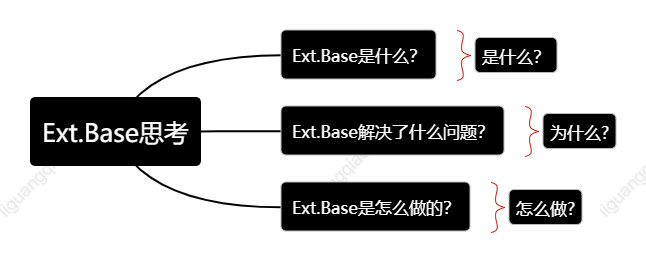

# 突发奇想:利用WebAssembly、Rust去将前端重器框架ExtJs进行迁移重构
- 思路1：从根拔起，利用wasm实现rust和js之间通信直接重写一边Ext.Base、Ext.Event等基础设施
- 思路2：初步简单整合，外部引入ext-all-debug.js框架，利用wasm实现rust和js之间通信获取Ext命名空间，然后逐个复写Ext函数

## ExtJs重构实验

### 重构目标

1. 学习ExtJs背后的设计思路和实现原理。
2. ExtJs的性能优化。
3. ExtJs可以使用ES6以及之上的特性。
4. ExtJs的轻量化。
5. 后续计划对比vue、react框架设计思路、实现方式的区别。
6. 后续计划结合wasm和rust技术栈尝试设计一个全新的前端js框架。

### ExtJs框架的总体架构

TODO

### Ext基础底层模块

#### Ext.Base

***Ext.Base***的思考

